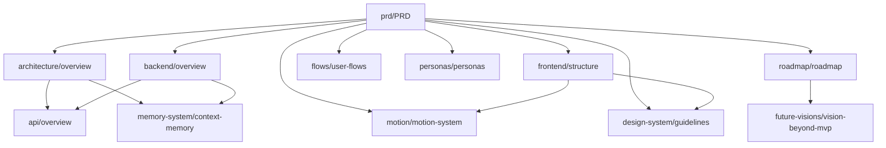

# The Solo Founder — Documentação (Document-First)

Este repositório adota **documentação como fonte de verdade** para produto, experiência, arquitetura e evolução técnica. Toda mudança material em comportamento, contrato de API, modelo de memória ou sistema visual deve ser refletida na documentação correspondente **antes** ou **em conjunto** com o merge de código.

## Mapa de navegação

| Pasta | Propósito | Documento âncora |
|-------|-----------|------------------|
| [`/docs/prd`](/docs/prd) | Visão, escopo, requisitos, decisões de produto | [`PRD-The-Solo-Founder.md`](/docs/prd/PRD-The-Solo-Founder.md) |
| [`/docs/architecture`](/docs/architecture) | Visão de sistema, limites, integrações | [`overview.md`](/docs/architecture/overview.md) |
| [`/docs/frontend`](/docs/frontend) | App shell, componentes, estado, performance | [`structure.md`](/docs/frontend/structure.md) |
| [`/docs/backend`](/docs/backend) | Serviços, autenticação, jobs, persistência | [`overview.md`](/docs/backend/overview.md) |
| [`/docs/design-system`](/docs/design-system) | Tokens, tipografia, grid, acessibilidade | [`guidelines.md`](/docs/design-system/guidelines.md) |
| [`/docs/motion`](/docs/motion) | Estados da IA, física, orquestração de animação | [`motion-system.md`](/docs/motion/motion-system.md) |
| [`/docs/flows`](/docs/flows) | Jornadas, estados de UI, edge cases | [`user-flows.md`](/docs/flows/user-flows.md) |
| [`/docs/personas`](/docs/personas) | Motivações, dores, critérios de sucesso | [`personas.md`](/docs/personas/personas.md) |
| [`/docs/roadmap`](/docs/roadmap) | Fases, milestones, critérios de release | [`roadmap.md`](/docs/roadmap/roadmap.md) |
| [`/docs/technical-decisions`](/docs/technical-decisions) | ADRs (Architecture Decision Records) | [`README.md`](/docs/technical-decisions/README.md) |
| [`/docs/api`](/docs/api) | Contratos REST/WebSocket, erros, versionamento | [`overview.md`](/docs/api/overview.md) |
| [`/docs/memory-system`](/docs/memory-system) | Contexto, políticas de retenção, privacidade | [`context-memory.md`](/docs/memory-system/context-memory.md) |
| [`/docs/future-visions`](/docs/future-visions) | Pós-MVP, narrativa de produto de longo prazo | [`vision-beyond-mvp.md`](/docs/future-visions/vision-beyond-mvp.md) |

## Princípios operacionais

1. **PRD governa escopo**: funcionalidades fora do escopo declarado exigem atualização explícita da PRD e do roadmap.
2. **UX e Motion são especificação**: animações e microinterações não são “detalhe cosmético”; são requisitos de percepção de inteligência e presença.
3. **ADRs para decisões irreversíveis**: escolha de motor gráfico, protocolo de streaming, modelo de memória e estratégia de deploy geram ADR em `/docs/technical-decisions`.
4. **API como contrato**: mudanças que quebram clientes exigem versionamento documentado em `/docs/api`.
5. **Privacidade por design**: políticas de memória e retenção são documentadas em `/docs/memory-system` e revisadas em releases que tocam dados pessoais.
6. **Mente do Founder como constituição**: alterações em setup, injeção no prompt ou gating do workspace exigem PRD + `/docs/memory-system` + `/docs/flows` alinhados.

## Relação entre documentos (leitura recomendada)

## Convenção de nomes

- Documentos de produto: `UPPERCASE` ou `kebab-case` descritivo.
- ADRs: `ADR-NNNN-titulo-curto.md` (ver template em `/docs/technical-decisions`).

---

## Related (Obsidian)

- [[prd/PRD-The-Solo-Founder|PRD — The Solo Founder]]
- [[architecture/overview|Arquitetura · Overview]]
- [[frontend/structure|Frontend · Estrutura]]
- [[backend/overview|Backend · Overview]]
- [[api/overview|API · Overview]]
- [[design-system/guidelines|Design System · Guidelines]]
- [[motion/motion-system|Motion System]]
- [[flows/user-flows|Fluxos de Usuário]]
- [[personas/personas|Personas]]
- [[memory-system/context-memory|Memória & Contexto]]
- [[roadmap/roadmap|Roadmap]]
- [[technical-decisions/README|ADRs · Index]]
- [[future-visions/vision-beyond-mvp|Future Visions]]

---

*Última atualização: documentação inicial gerada para baseline do projeto The Solo Founder.*
