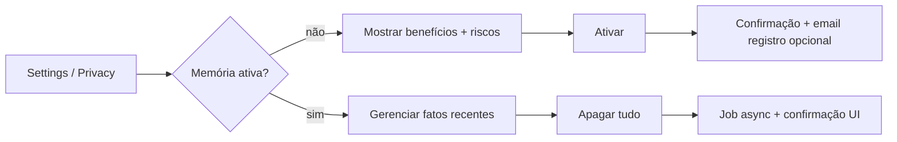

# Fluxos de Usuário — The Solo Founder

**Objetivo:** descrever jornadas **ponta-a-ponta** com estados de UI, eventos de backend e **estados da IA Viva**.  
**Relaciona com:** [`/docs/api/overview.md`](/docs/api/overview.md), [`/docs/prd/PRD-The-Solo-Founder.md`](/docs/prd/PRD-The-Solo-Founder.md) (§1.5, RF-MF).

---

## 1. Onboarding: autenticação → Mente do Founder → workspace

O **primeiro passo** de uso do produto, após autenticação, é a **criação da Mente do Founder**: fluxo guiado em que a IA ajuda o usuário a registrar **quem ele é**, **visão**, **missão** e **valores** (testamento revisável). Só então o **chat principal** e o workspace pleno ficam disponíveis (política padrão; ver PRD §1.5).

| Passo | Ação do usuário | UI | Evento técnico | Estado IA |
|-------|-----------------|-----|----------------|-----------|
| 1 | Abre app | splash minimal | `session.bootstrap` | Idle |
| 2 | Autentica | form clean | `auth.success` | Idle |
| 3 | Inicia **Mente do Founder** | tela dedicada (split ou full); progresso | `founder_mind.started` | Listening / Thinking (pergunta) |
| 4 | Responde perguntas guiadas | uma pergunta por vez; input + sugestões curtas | `founder_mind.step` | alternância Listening → Thinking |
| 5 | Revisa sumário | cartão editável | `founder_mind.review` | Thinking |
| 6 | Confirma e grava | CTA “Esta é a minha mente” | `founder_mind.completed` | Generating (opcional micro) → Idle |
| 7 | Entra no workspace | layout 50/50 + chat | `workspace.unlocked` | Idle |
| 8 | (Opcional) Escolhe modo Personal/Business | `ModeSwitch` | `mode.changed` | crossfade |
| 9 | Primeira mensagem no chat | composer | `input.activity` → … | Listening → … |

**Edge cases**

- **Abandono no meio:** política MVP (rascunho vs obrigatório) definida na PRD; UI deve permitir **retomar** exatamente do passo salvo.  
- **Edição posterior:** Configurações → Mente do Founder; opcional fluxo curto de revalidação.  
- **Falha de rede:** banner discreto + estado `reconnecting` (não confundir com Thinking).  
- **Cancelamento** no chat (após unlock): comando stop → `model.cancelled` → Idle em ≤ 200ms visual.

---

## 2. Upload de arquivo + leitura

| Passo | UI | Evento | Estado IA |
|-------|-----|--------|-----------|
| 1 | drag-drop highlight | `upload.start` | Listening |
| 2 | progress bar composer | `upload.progress` | Listening |
| 3 | parse servidor | `file.parsing` | Reading Files |
| 4 | injeção no contexto | `file.ready` | Thinking |
| 5 | resposta | streaming | Generating |

**Erro de parse:** mensagem assistant curta + estado Idle; log técnico no cliente (opt-in telemetria).

---

## 3. Troca Personal → Business mid-thread

| Passo | UI | Comportamento |
|-------|-----|---------------|
| 1 | toggle | animação paleta + motion coefficients |
| 2 | sistema | injeta nota curta interna (opcional UI): “Modo alterado.” |
| 3 | memória | segmentação por namespace; **Mente do Founder** permanece âncora transversal |

---

## 4. Memória — opt-in e revogação

**Nota:** a **Mente do Founder** é artefacto distinto da memória episódica; apagar “memória de conversas” **não** apaga a mente salvo ação explícita do usuário (fluxo dedicado).

---

## 5. Caixa de legenda + botão de som (Caption stack)

Especificação de produto: PRD §6.4. Este fluxo cobre **interação do usuário** com a coluna **núcleo → som → legenda**.

| Passo | UI / ação | Comportamento |
|-------|-----------|---------------|
| 1 | IA começa a responder | legenda começa a “digitar” página 1 (estilo legenda de filme) |
| 2 | Texto excede a página | sistema cria página 2; seta ▶ aparece com micro pulse |
| 3 | Usuário clica ▶ (ou →) | avança para próxima página; ◀ aparece |
| 4 | Usuário clica ◀ (ou ←) | volta para página anterior; **streaming continua em segundo plano** acumulando “+N páginas” |
| 5 | Usuário clica “follow” | retorna à página atual de fala |
| 6 | Usuário clica botão de som | alterna `sound_on` ↔ `sound_off`; preferência persiste |
| 7 | TTS indisponível | botão entra em `unavailable` com tooltip; legenda continua funcionando |
| 8 | `prefers-reduced-motion` | render progressivo vira fade por página |

**Edge cases**

- **Cancelamento:** legenda congela na página atual com microcopy `(interrompido)`; setas continuam funcionando para revisitar.
- **Resposta muito longa:** buffer mantém todas as páginas da resposta atual + últimas N falas; histórico anterior fica em drawer **na própria coluna esquerda** (a fala da IA nunca duplica no painel direito — ver PRD §6.4.3).
- **Artefato gerado:** se a resposta incluir gráfico/arquivo/link/código, ele aparece no **painel direito** como `ArtifactCard`; a fala referencia o artefato pela legenda esquerda ("gerei o gráfico — aparece à direita"). Ordem de chegada é honesta com o backend (artefato pode vir antes ou depois da fala correspondente).
- **Foco de teclado:** ao focar a caixa de legenda, ←/→ navegam páginas; ao focar o composer, atalhos da legenda **não** roubam input.

---

## 6. Fluxo de voz (MVP — IA sempre viva, mic com mute)

> **Premissa:** a IA está sempre viva. A captura de áudio é controlada pelo `MicMuteToggle` ao lado do `SoundToggle`. Não há push-to-talk: o usuário **ativa o mic uma vez** e a IA passa a escutar continuamente até que o usuário **mute**.

| Passo | UI | Evento | Estado IA |
|-------|-----|--------|-----------|
| 1 | sessão abre com `mic_off` (default) | `session.ready` | Idle |
| 2 | usuário clica `MicMuteToggle` (e concede permissão na 1ª vez) | `mic.enabled` | Idle (vivo, escutando) |
| 3 | usuário fala; energia de áudio detectada | `input.activity {kind: voice}` | Listening (áudio) |
| 4 | pausa de fala / VAD detecta fim de turno | `voice.turn_end` | Thinking |
| 5 | resposta inicia | `model.first_token` | Generating |
| 6 | usuário clica `MicMuteToggle` para silenciar | `mic.muted` | volta a Idle; buffer parcial descartado |

**Edge cases**

- **Mute durante Listening:** transcrição parcial em andamento é **descartada** localmente; nenhum áudio residual é enviado.
- **Mute durante Thinking/Generating:** não interrompe a resposta em curso; apenas garante que o próximo turno não capture áudio.
- **Permissão negada pelo SO/navegador:** botão entra em `unavailable` com tooltip honesta; fluxo continua só por texto.
- **Sem STT na release:** botão em `unavailable`; nenhuma simulação de escuta.

---

## 6.A Fluxo de menção a artefato (`@artefato`)

> Permite ao usuário **referenciar** um artefato **gerado pela IA** já existente no painel direito para perguntar/transformar, sem reanexar contexto. Ver PRD §8.5 e RF-MEN-*.

**Escopo:** `@` lista **somente** `ai.artifact.*`. Para arquivos do usuário, ver §6.B (upload/drag-drop).

| Passo | UI | Evento | Estado IA |
|-------|-----|--------|-----------|
| 1 | usuário digita `@` no composer | `composer.mention_open` | Idle |
| 2 | `ArtifactMentionPicker` abre listando **apenas artefatos da IA** do thread por recência | — | Idle |
| 3 | usuário busca/filtra/escolhe (mouse ou teclado `↑↓ Enter`) | `composer.mention_select {artifact_id, type}` | Idle |
| 4 | chip aparece no composer; usuário continua digitando a pergunta | — | Idle / Listening (texto) |
| 5 | envio do turno carrega IDs dos artefatos referenciados | `turn.submit {mentions: [id…]}` | Thinking |
| 6 | IA gera fala (esquerda) e, se houver, **novo** artefato derivado (direita) | `model.token` + `artifact.created` | Generating |

**Alternativas equivalentes:** drag-drop do `ArtifactCard` (gerado pela IA) para o composer; menu de contexto do card → "Mencionar no composer".

**Edge cases**

- **Thread sem artefatos da IA:** picker abre com microcopy guiando para upload/drag-drop em vez de mostrar lista vazia.
- **Artefato muito grande:** chip mostra aviso; backend envia sumário + handle de fetch sob demanda.
- **Artefato indisponível/expirado:** chip vira `unavailable`; envio bloqueado; microcopy sugere remover ou substituir.
- **Transformação:** "altere o gráfico para barras" gera **novo** `ArtifactCard`; o original permanece no painel (lineage honesto).
- **Falha ao interpretar:** a IA **diz na fala (esquerda)** que não conseguiu ler o artefato; nunca inventa conteúdo.

---

## 6.B Fluxo de anexar arquivos do usuário (upload / drag-drop)

> Arquivos vindos **do usuário** entram pelo composer (upload/drag) ou pelo painel direito (drag-drop direto). **Nunca** via `@`. Ver PRD §8.6 e RF-UPL-*.

| Caminho | Passo | UI | Evento | Estado IA |
|---------|-------|-----|--------|-----------|
| Upload | 1 | clique no botão de clipe do composer | `composer.upload_open` | Idle |
| Upload | 2 | seleção no SO → `AttachmentChip` no composer | `upload.start` | Listening |
| Drag → composer | 1 | arrastar arquivo do SO sobre o composer | `composer.drag_enter` | Listening |
| Drag → composer | 2 | drop → vira `AttachmentChip` no composer | `upload.start` | Listening |
| Drag → painel direito | 1 | arrastar arquivo do SO sobre o painel direito | `artifacts.drag_enter` | Listening |
| Drag → painel direito | 2 | drop → vira `user.attachment` associado ao próximo turno | `upload.start` (escopo: painel) | Listening |
| Envio | 3+ | turno enviado; backend faz parse | `file.parsing` → `file.ready` | Reading Files → Thinking |
| Resposta | 4+ | IA responde na fala à esquerda; pode gerar artefatos à direita | `model.token` + `artifact.created` (opcional) | Generating |

**Regras-chave**

- Drag no composer = upload normal (chip no composer antes do envio).
- Drag no painel direito sem texto = turno só-anexo (envio direto).
- Anexos do usuário viram `user.attachment` no painel direito, **nunca** `ai.artifact.*`, e **nunca** aparecem no `@`.
- Distinção visual: chip compacto (anexo do usuário) vs card maior (artefato da IA).

---

## 7. Métricas de fluxo (instrumentação)

| Evento analytics (exemplo) | Propriedades mínimas |
|----------------------------|----------------------|
| `first_message_completed` | `mode`, `latency_ms`, `trace_id` |
| `founder_mind_completed` | `steps_count`, `duration_ms`, `had_draft` |
| `upload_success` | `mime`, `size_bucket` |
| `mode_switch` | `from`, `to`, `thread_id` |
| `caption_page_advance` | `direction` (`next`\|`prev`), `via` (`mouse`\|`keyboard`), `is_follow_back` |
| `caption_follow_back_to_live` | `pages_behind` |
| `sound_toggle` | `from`, `to`, `tts_available` |
| `mic_toggle` | `from` (`mic_on`\|`mic_off`), `to`, `stt_available`, `permission_state` |
| `artifact_mention_open` | `trigger` (`at`\|`drag`\|`menu`), `available_count` |
| `artifact_mention_submit` | `mentions_count`, `types[]`, `had_unavailable` |

---

## Related (Obsidian)

- [[../prd/PRD-The-Solo-Founder|PRD]]
- [[../api/overview|API · Overview]]
- [[../motion/motion-system|Motion System]]
- [[../memory-system/context-memory|Memória & Contexto]]
- [[../personas/personas|Personas]]
- [[../README|Docs Hub]]

---

*Adicionar wireframes quando o design entregar Figma; manter paridade texto↔frame.*
