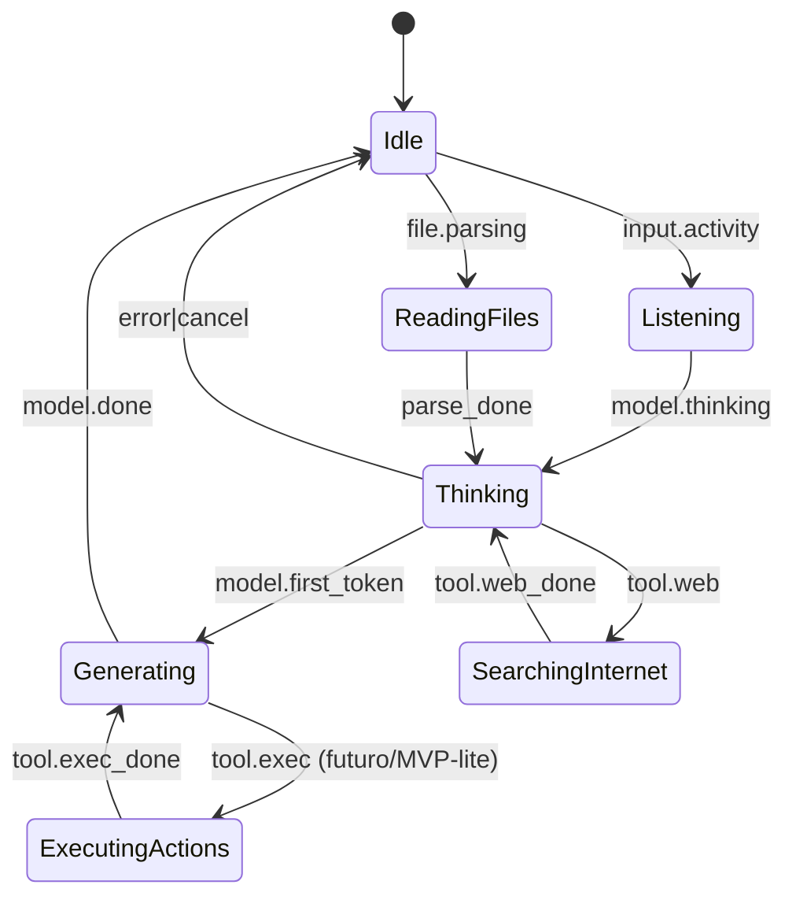

# Motion System — The Solo Founder (IA Viva)

**Objetivo:** definir a **linguagem cinética** do produto: como o motion comunica **estado cognitivo**, **operação real** e **premium feel**, sem cair em excesso nem em desonestidade visual.  
**Relaciona com:** [`/docs/prd/PRD-The-Solo-Founder.md`](/docs/prd/PRD-The-Solo-Founder.md), [`/docs/design-system/guidelines.md`](/docs/design-system/guidelines.md), [`/docs/frontend/structure.md`](/docs/frontend/structure.md).

---

## 1. Princípios de motion (lei do produto)

| Lei | Definição | Enforcement |
|-----|-----------|-------------|
| **M1 — Honest motion** | Todo estado “ativo” mapeia a evento backend/ cliente verificável. | Testes e2e de correlação `event_id` |
| **M2 — Continuidade** | Transições são **diferenciáveis** mas **sem cortes duros** de cor/escala. | crossfade + ease custom |
| **M3 — Hierarquia** | O núcleo é sempre o **primeiro** landing visual; sentidos são secundários. | z-index + blur |
| **M4 — Respeito cognitivo** | Frequências evitam **flicker** 3–50Hz; pulsos grandes < 2Hz. | revisão de acessibilidade |
| **M5 — Reduced motion** | `prefers-reduced-motion: reduce` desliga partículas pesadas. | feature flag CSS + runtime |

---

## 2. Máquina de estados (formalismo)

### 2.1 Estados e transições permitidas

**MVP-lite para ExecutingActions:** apenas visual quando **ações locais** ocorrerem (ex.: exportar transcript) — nunca simular integrações inexistentes.

### 2.2 Prioridade em conflito (determinístico)

1. `error` / `reconnecting` (overlay sutil, não estado do núcleo)  
2. `ExecutingActions` (se real)  
3. `GeneratingResponse`  
4. `SearchingInternet` / `ReadingFiles`  
5. `Thinking`  
6. `Listening`  
7. `Idle`

---

## 3. Curvas, easing e tempo

| Uso | Curva sugerida | Duração típica |
|-----|----------------|-----------------|
| Mudança de estado do núcleo | cubic-bezier premium (custom) | 240–420ms |
| Aparição de sentido | ease-out “cinematic” | 180–320ms |
| Desaparecimento | ease-in | 120–200ms |
| Switch Personal/Business | ease-in-out separado cor/motion | 360–600ms |

**Nota:** evitar `linear` em escalas humanas; usar **ease com intenção**.

---

## 4. Camadas do render (pipeline sugerido)

1. **Background field** — gradiente dinâmico + noise UV lento  
2. **Particle sim** — N corpos com forças (CPU ou compute shader TBD)  
3. **Core mesh** — esfera com displacement suave + fresnel  
4. **Post** — bloom controlado, vignette leve, grain 1–2% só no Personal  
5. **Senses layer** — instancing de ícones + conectores procedural (Bezier noise)
6. **Caption stack** (DOM/Canvas 2D acima do canvas 3D) — botão de som + caixa de legenda paginada (ver §4.1)

### 4.1 Caption stack (legenda + som) — animação

Camada **DOM**, sobreposta ao canvas, alinhada ao **eixo central** abaixo do núcleo. Ver PRD §6.4 para especificação de produto.

**Botão de som (TTS toggle):**

| Estado | Animação |
|--------|----------|
| `sound_off → sound_on` | crossfade do ícone (180ms) + halo curto pulsando 1× |
| `sound_on` (ativo, IA falando) | halo respirando acoplado à amplitude do TTS (suavizado, EMA 250ms) |
| `unavailable` | sem animação; ícone neutro |

**Botão de mute do microfone (Mic toggle):**

Par visual ao lado do botão de som; representa o canal de **entrada** (a IA escutando) e fecha a simetria com o canal de **saída** (a IA falando).

| Estado | Animação |
|--------|----------|
| `mic_off → mic_on` | crossfade do ícone (180ms) + halo expandindo 1× anunciando início de captura |
| `mic_on` (escutando) | halo respirando acoplado à **amplitude do áudio captado** (EMA 200ms); sincronizado com o anel de listening do núcleo |
| `mic_on → mic_off` | **mute instantâneo** (< 100ms): halo colapsa em fade-out curto (120ms); anel de listening do núcleo cessa imediatamente |
| `unavailable` | sem animação; ícone neutro com leve dim |

**Regra de honestidade visual:** com `mic_off`, **nenhuma** camada (botão, núcleo, legenda) pode reagir a áudio. O anel de listening do núcleo só responde a entrada de áudio quando `mic_on`; caso contrário, Listening é acionado **apenas** por digitação no composer.

**Caixa de legenda — render progressivo:**

| Cenário | Curva |
|---------|-------|
| `sound_on` | timestamps por palavra/frase do TTS guiam a entrada de cada token visual |
| `sound_off` | cadência derivada de **WPM-alvo** (ex.: 240–320 WPM equivalente, calibrar) com micro-jitter humano |
| `prefers-reduced-motion` | sem caractere-a-caractere; **fade in** de 120–180ms por página |

**Transição entre páginas (game-style):**

- Avanço (▶): página atual desliza levemente para cima e fade-out (160ms); nova página fade-in (180ms) — **sem** flash, **sem** translação grande.
- Volta (◀): mesma curva no sentido oposto, sem inverter o sentido emocional (não dramatizar “rewind”).
- Setas têm **micro pulse** quando a IA recém-criou nova página e o usuário ainda não avançou (chamada de atenção sutil; não piscar mais que 2 ciclos).

**Sincronização com estados do núcleo:**

- `Generating` no núcleo ↔ legenda **digitando** página atual.
- `Thinking` ↔ legenda mostrando microfrase/“…” em vez de texto.
- `Idle` ↔ legenda em estado calmo (vazia ou frase ambiente).

---

## 5. Detalhamento por estado

### 5.1 Idle

- **Respiração:** scale 1.0 ± 1.2% (Personal) / ± 0.8% (Business).  
- **Partículas:** baixa energia; velocidade máxima clampada.  
- **Som:** ausente por default.

### 5.2 Listening

- **Premissa:** a IA está **viva** e potencialmente escutando o tempo todo. A diferença entre "vivo em silêncio" e "vivo escutando áudio" é controlada pelo `MicMuteToggle`.
- **Áudio (quando `mic_on`):** bandas de energia do mic modulam **anel de listening** (shader); o halo do botão de mic e o anel do núcleo compartilham a **mesma fonte** de amplitude (coerência).
- **Áudio (quando `mic_off`):** anel de listening do núcleo **não reage** a nenhum sinal sonoro — comportamento auditável.
- **Texto:** cadência de keystrokes modula micro ondas (debounce 40ms), independente do estado do mic.

### 5.3 Thinking

- **Partículas:** aumento de **entropia** controlada.  
- **Conectores neuronais:** spawn rate ligado a `thinking_duration` com cap.

### 5.4 Searching Internet

- **Órbitas:** ícones pequenos representando “fontes” (abstração).  
- **Linhas:** Bezier com **jitter** baixo; cor derivada de accent Business.

### 5.5 Reading Files

- **Docs:** sprites ou meshes leves com **tilt** coerente com órbita.  
- **Scan:** bandas de luz **paralelas** lentas (evitar estroboscópio).

### 5.6 Generating Response

- **Acoplamento ao stream:** token throughput → alimenta **EMA** que modula glow (janela 400–900ms).  
- **Sincronização:** se throughput alto, **não** aumentar brilho ilimitadamente — usar soft cap.

### 5.7 Executing Actions

- **Braços:** 2–6 conectores máx visíveis; mais que isso colapsa em “cluster”.  
- **Ícones:** somente os ativos; pulsos **assíncronos** leves (evitar lockstep).

---

## 6. Performance e qualidade

| Tier | Critério | Estratégia |
|------|----------|------------|
| A | GPU mid + 60fps | pipeline completo |
| B | GPU low / iGPU | reduzir N partículas 40–60% |
| C | `prefers-reduced-motion` | partículas off; núcleo 2D shader leve |

**Métrica:** `presence_frame_time_p95` < 22ms em tier A.

---

## 7. Ferramentas recomendadas

- **Framer Motion:** layout do app, painel chat, crossfades de modo.  
- **R3F / Three.js:** núcleo + partículas + post-processing.  
- **Lottie/Rive:** somente para ícones de sentidos se necessário offline (evitar mistura incoerente).

**ADR obrigatório:** escolha final CPU vs GPU particles.

---

## 8. Checklist de revisão (antes de ship)

- [ ] Todos os estados têm **evento** associado  
- [ ] Nenhuma animação depende de framerate não fixado (delta time)  
- [ ] Reduced motion validado com usuários internos  
- [ ] Saturação dentro dos tokens de cor  
- [ ] Conectores não cobrem texto do chat em viewport estreito  

---

## Related (Obsidian)

- [[../prd/PRD-The-Solo-Founder|PRD]]
- [[../design-system/guidelines|Design System]]
- [[../frontend/structure|Frontend · Estrutura]]
- [[../flows/user-flows|Fluxos de Usuário]]
- [[../README|Docs Hub]]

---

*Este documento evolui com protótipos; anexar links de vídeo de referência interna quando existirem.*
