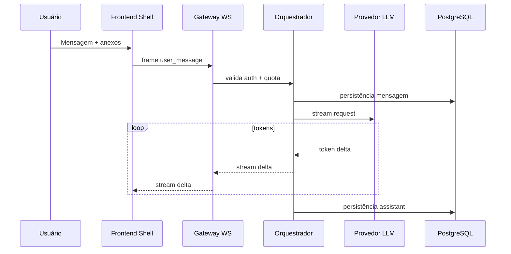

# Product Requirements Document (PRD)

## The Solo Founder

**Versão do documento:** 1.0  
**Status:** Aprovado para baseline de MVP  
**Classificação:** Interno — Produto & Engenharia  
**Dono do documento:** Product Lead (The Solo Founder)  
**Stakeholders:** Design, Frontend, Backend, ML/Infra, Legal/Privacy  

---

## Sumário executivo

**The Solo Founder** é uma aplicação **desktop e web** que entrega uma experiência de IA **premium**, **altamente visual** e **emocionalmente presente**, voltada a **founders**, **freelancers** e **operadores solo**. O diferencial não é “mais um chat”, mas uma **presença digital inteligente** — percebida como **viva**, **contínua** e **operacionalmente consciente** — que acompanha o usuário em tempo real.

O MVP prioriza: **setup obrigatório da Mente do Founder** (IA guia o registro de quem o usuário é, visão, missão e valores — ver §1.5), **chat em tempo real com streaming**, **interface visual viva** com **estados animados**, **uploads simples**, **markdown**, **memória contextual básica** e **sincronização emocional** entre linguagem da IA e linguagem do motion design. O **switch Personal / Business** foi adiado para pós-MVP (ver §20.3).

**Direção estratégica (pós-MVP):** evoluir para que um **founder** possa **descobrir outros founders** de **empresas parecidas** e **compartilhar serviços** — seja com **apoio das IAs de cada lado** (matching e mediação com supervisão humana), seja por **chat direto entre pessoas** na plataforma — com opt-in, privacidade e moderação como premissas (detalhamento em §1.2 e §20).

Este documento consolida **visão estratégica**, **requisitos funcionais e não-funcionais**, **arquitetura de experiência**, **motion system**, **arquitetura técnica** e **governança documental** para operação como startup de alto padrão.

---

## 1. Visão do produto

### 1.1 Declaração de visão

Criar a camada de **companionship computing** mais sofisticada do mercado para profissionais solo: uma IA que o usuário **sente ao lado**, **enxerga pensando**, **percebe operando** e **confia como entidade contínua** — sem sacrificar utilidade, privacidade ou controle.

### 1.2 Horizonte de produto: rede de founders e troca de valor

Para além do MVP, a visão explícita do The Solo Founder inclui uma **camada de descoberta e colaboração entre founders**: facilitar que operadores solo encontrem **pares com empresas similares** e **compartilhem serviços** (freelas, parcerias, indicações, pacotes complementares, mentoria operacional, etc.).

**Modalidades previstas (não excludentes):**

| Modalidade | Descrição | Valor para o usuário |
|------------|-----------|----------------------|
| **IA ↔ IA (mediada)** | As IAs dos dois lados ajudam a **estruturar intenção**, **resumir contexto** e **propor encaixes** sob revisão humana | Baixa fricção, linguagem comum, menos “cold outreach” |
| **Humano ↔ Humano (chat)** | Canal de mensagens **direto** entre founders na plataforma após match ou convite aceito | Negociação, tom, confiança e fechamento em canal único |

**Princípios dessa evolução:** opt-in explícito, perfis e sinais de similaridade **auditáveis**, moderação e segurança **antes** de escala, e clara separação entre **recomendação algorítmica** e **compromisso comercial** (termos, reputação, opcionalmente pagamentos em fases posteriores).

### 1.3 Princípios de produto (não negociáveis)

| Princípio | Definição operacional |
|-----------|------------------------|
| **Presença contínua** | A interface visual da IA nunca “morre”; em idle há **vida basal** perceptível. |
| **Inteligência visível** | Estados cognitivos e operacionais são **traduzidos em motion** de forma honesta (sem simular capacidades inexistentes). |
| **Utilidade primeiro** | Emoção e cinematografia **amplificam** produtividade; não substituem clareza, latência previsível e qualidade de resposta. |
| **Controle explícito** | Memória, uploads e preferências são **transparentes** e **revogáveis**. |
| **Premium por disciplina** | Sofisticação vem de **restraint**, **microinteração**, **performance** e **coerência semântica** — não de excesso visual. |
| **Bússola explícita** | A IA ancora-se na **Mente do Founder** para coerência de identidade, visão, missão e valores | Injeção no contexto + UX de revisão; sem contradição casual com o testamento |

### 1.4 Posicionamento aspiracional (referências culturais)

Inspiração de barra de qualidade (não implicação de parceria): **OpenAI** (excelência em modelo e streaming), **Humane** (presença ambiental), **Nothing** (minimalismo industrial), **Apple** (polimento e hierarquia), **Arc** (narrativa de “OS layer”), **Character.AI** (relação persona-usuário), **Jarvis / sci-fi minimalista** (metáfora de núcleo cognitivo).

**Racional:** o usuário-alvo associa “premium” a **calma confiante**, não a brilho agressivo.

### 1.5 Mente do Founder (Founder’s Mind) — primeiro passo do setup (obrigatório)

O **primeiro passo** do setup do software, após autenticação, é a **criação da Mente do Founder**: um ritual guiado em que a **IA conduz o founder** a construir o **testamento** de **quem ele é**, **qual sua visão**, **missão** e **valores** — e, quando fizer sentido, extensões como **princípios de decisão**, **non-negotiables** e **público-alvo** (campos evolutivos; ver critérios de conclusão).

| Conceito | Definição |
|----------|-----------|
| **Mente do Founder** | Artefacto estruturado e persistente (texto + campos semânticos) que codifica identidade e bússola estratégica do usuário. |
| **Testamento (metáfora de produto)** | Declaração explícita e revisável — não marketing vazio — que a IA usa como **âncora ética e contextual**. |
| **Setup guiado** | Fluxo conversacional passo a passo (uma pergunta por vez, clarificações, sumário final antes de gravar). |

**Obrigatoriedade:** até a **Mente do Founder** atingir o estado **“completa”** (mínimo definido em RF-MF), o produto **não** expõe o uso pleno do workspace (chat principal + threads produtivas) **ou** exibe um **modo limitado** apenas para continuar o setup — decisão de UX a consolidar em ADR; o default recomendado é **bloqueio suave** (full-screen elegante com saída só por “Salvar rascunho” / “Continuar depois” **desabilitado** no MVP se a política for “zero uso sem mente”). *Alternativa beta:* flag interna `SKIP_FOUNDER_MIND` para dogfood.

**Usos da Mente do Founder pela IA (MVP e além):**

| Uso | Descrição |
|-----|-----------|
| **Tomada de decisão** | Priorizar opções, trade-offs e recomendações alinhados a **valores** e **visão** declarados. |
| **Tom e escopo** | Ajustar profundidade, assertividade e risco de sugestões sem contradizer o “quem sou”. |
| **Memória episódica** | Evitar drift: fatos novos **não** sobrescrevem valores sem revisão explícita do usuário. |
| **Futuro (rede de founders)** | Base consentida para **similaridade** e apresentação (“o que posso compartilhar com pares”). |

**Racional de produto:** sem uma âncora explícita de identidade e propósito, a IA tende a **respostas genéricas** ou a **alucinar alinhamento**; a Mente do Founder transforma a relação em **coerência verificável** e aumenta confiança percebida.

**UX mínima:** revisão final em uma página “cartão” editável; reabrir em **Configurações → Mente do Founder** com histórico de versões (MVP: última versão + data; pós-MVP: diff).

---

## 2. Problema

### 2.1 Problema principal

Profissionais solo usam múltiplas ferramentas de IA e produtividade, mas experimentam:

- **Fragmentação cognitiva**: alternância constante entre chat, busca, arquivos e calendário dissolve foco.
- **Frieza da interface**: chat tradicional comunica “ferramenta”, não “parceiro operacional”.
- **Baixa percepção de continuidade**: ausência de feedback visual contínuo gera sensação de **máquina ociosa** ou **caixa-preta**.
- **Ansiedade de trabalho solo**: falta de rituais e “presença” aumenta carga emocional em tarefas abertas.

### 2.2 Problemas adjacentes (MVP: endereço parcial)

| Problema adjacente | Como o MVP endereça | Limite explícito no MVP |
|--------------------|---------------------|-------------------------|
| Context switching | Chat unificado + sensores visuais simbólicos | Integrações reais limitadas a escopo técnico definido |
| Memória de longo prazo | Memória contextual **básica** | Sem grafo complexo multi-fonte |
| Automação operacional | Metáfora visual de “executando ações” | Sem workflow builder |
| IA “sem bússola” sobre o humano | **Mente do Founder** no primeiro setup | Campos mínimos obrigatórios; refinamento contínuo opcional |

---

## 3. Oportunidade

### 3.1 Mercado e timing

- **Democratização de modelos** reduziu barreira de “boa resposta”; a diferenciação migra para **experiência**, **confiança** e **ritual de uso**.
- **Desktop + web** permite presença “sempre aberta” em segundo monitor — segmento subatendido por apps puramente mobile.
- **Solo operators** pagam por **clareza**, **velocidade** e **redução de solidão operacional** quando empacotados com ética de dados.
- **Curva de rede (futuro):** founders com problemas e stacks **semelhantes** tendem a **trocar fornecimento e aprendizado** de forma recorrente; uma camada de **descoberta + colaboração** (IA-medida e/ou chat humano) aumenta **LTV** e **defensibilidade** sem competir apenas em preço de tokens.

### 3.2 Hipótese de valor (testável)

> Se entregarmos uma IA com **presença visual contínua** + **Mente do Founder obrigatória** (âncora de identidade) + **chat minimalista premium** com **memória básica transparente**, então **retenção D7** e **sessões longas** aumentarão versus um chat equivalente sem metáfora viva — mantendo **satisfação de tarefa (task success)** no mesmo patamar ou superior.

**Métricas proxy:** ver Seção 15.

---

## 4. Personas

**Documento canônico:** [`/docs/personas/personas.md`](/docs/personas/personas.md)

### 4.1 Resumo para decisões de escopo

| Persona | Papel | Job-to-be-done (JTBD) | Exigência emocional |
|---------|-------|----------------------|---------------------|
| **Sofia — Founder solo** | Constrói MVP, vende, opera | “Preciso de um parceiro que me ajude a decidir e executar texto/código sem me dispersar.” | Presença estável, ritmo calmo |
| **Marcus — Freelancer premium** | Entrega para clientes | “Preciso de velocidade, estética e clareza para não parecer amador.” | Confiança, polimento |
| **Rita — Operadora / COO de um** | Processos, email, planilhas | “Preciso que a IA acompanhe minha rotina sem virar brinquedo.” | Seriedade, eficiência |

**Decisão de produto:** o MVP deve agradar **Rita** (seriedade) sem sacrificar **Sofia** (companheirismo). **Marcus** valida o “premium feel”.

---

## 5. Proposta de valor

### 5.1 Proposta central

**“A IA que permanece viva ao seu lado — e trabalha com você em silêncio visível.”**

### 5.2 Pilares de valor

| Pilar | Benefício tangível | Prova na interface |
|-------|---------------------|-------------------|
| **Presença** | Redução de sensação de isolamento | Núcleo animado + estados contínuos |
| **Inteligência percebida** | Maior confiança em respostas longas | Thinking/Searching/Reading visualmente distintos |
| **Foco** | Menos ruído cognitivo | Chat minimalista + hierarquia rígida |
| **Contexto** | Respostas mais relevantes | Memória básica + Mente do Founder (switch Personal/Business pós-MVP, §20.3) |
| **Colaboração (horizonte)** | Encontrar pares e **compartilhar serviços** com baixa fricção | Rede de founders + IA como facilitadora + chat humano (pós-MVP; ver §1.2) |

### 5.3 Anti-proposta (o que não somos)

- Não somos um **metaverso** nem um **avatar falante** obrigatório.
- Não somos um **OS completo** no MVP.
- Não somos **companheiro romântico**; evitamos sinalizadores que sexualizam ou infantilizam a relação.

---

## 6. Arquitetura da interface (IA)

### 6.1 Layout: split vertical 50/50

| Região | Proporção | Função |
|--------|------------|--------|
| **Esquerda — IA Viva** | ~50% (min 45%, max 55% em breakpoints) | Representação **exclusiva** do “organismo digital” |
| **Direita — Chat** | Complemento | Conversa, anexos, rendering markdown/código |

**Decisão de UX:** split fixo no MVP para **clareza de metáfora**. Resize drag opcional em release posterior (fora do MVP).

### 6.2 Hierarquia visual (z-order conceitual)

1. Background dinâmico (baixo contraste, respira com idle)
2. Partículas / campos (meio)
3. **Núcleo (orbe)** (centro focal)
4. **Sentidos** (ícones e conectores)
5. Chat (painel separado; não compete em saturação com o núcleo)

### 6.3 Elemento central — Núcleo vivo

**Especificação de intenção (MVP):**

- Forma primária: **esfera / orbe** com **shader** ou **material procedural** leve.
- **Pulso** baseado em **respiração** (low-frequency sine + micro noise).
- **Partículas**: contagem moderada; densidade aumenta em Thinking/Generating.
- **Glow**: acoplado a estado e à intensidade de streaming (ver motion doc).
- **Ondas**: anéis de interferência sutis em Listening e Generating.

**Racional técnico/UX:** WebGL/Three.js oferece continuidade fluida; Canvas 2D + shaders é alternativa se bundle/CPU for crítico — decisão via ADR.

### 6.4 Eixo central abaixo do núcleo — Sound toggle + Caixa de legenda

Diretamente **abaixo do núcleo da IA**, no eixo vertical central da metade esquerda, existe uma **coluna funcional fixa** composta por dois elementos sequenciais:

```
[ NÚCLEO DA IA ]
       │
 [ ◐ SOM ]  [ 🎙 MIC ]   ← par de controles (entre núcleo e legenda)
       │
[ ◀  CAIXA DE LEGENDA  ▶ ]
```

Essa coluna é parte integrante da identidade visual da IA Viva e **não** vive no painel direito: ela é o **único canal** onde a fala/voz da IA acontece (ver §6.4.3 para a separação canônica de canais). O painel direito é reservado para **mensagens do usuário** e **artefatos** (gráficos, arquivos, links, etc.) que a IA decide produzir.

**Premissa fundadora (IA sempre viva):** a IA **está sempre escutando** enquanto a sessão está aberta — não há “push-to-talk”. Escutar é parte do **estado vivo** do personagem. O usuário tem **controle total** via o **botão de mute do microfone** (ver §6.4.1.B), que pausa imediatamente a captura de áudio. Os dois botões — **som** (o que a IA fala) e **mic** (o que a IA ouve) — formam um **par simétrico** de controle bidirecional do canal voz.

#### 6.4.1.A Botão central de som (TTS toggle)

- **Posição:** centralizado horizontalmente, **entre** o núcleo e a caixa de legenda.
- **Função:** alternar entre **modo voz** (IA fala em áudio sintetizado / TTS) e **modo silencioso** (apenas legenda).
- **Estados visuais:**
  - `sound_on` — ícone de som ativo + halo discreto pulsando em sincronia com a fala.
  - `sound_off` — ícone de som riscado/mute, neutro.
  - `unavailable` — desabilitado (cinza) se TTS não estiver disponível na release; tooltip explica.
- **Persistência:** preferência salva por usuário e por dispositivo (`tts_preference`).
- **Acessibilidade:** rótulo claro (`aria-label="Ativar voz da IA"` / `"Silenciar voz da IA"`); foco visível; atalho de teclado a definir.
- **Honestidade:** se TTS estiver indisponível ou em fallback, o botão **não** mente — fica em `unavailable` com mensagem.
- **MVP vs futuro:** no MVP o botão **existe e persiste preferência** mesmo que TTS real seja entregue logo depois — protege a metáfora desde o início. ADR define se TTS streaming entra no MVP ou em release imediatamente posterior.

#### 6.4.1.B Botão de mute do microfone (Mic toggle)

- **Posição:** **ao lado** do botão de som, na mesma linha horizontal, entre o núcleo e a caixa de legenda. Distância simétrica ao redor do eixo central (par visual).
- **Função:** alternar entre **mic ativo** (a IA está captando áudio em background — estado “vivo”) e **mic mudo** (captura de áudio totalmente pausada).
- **Default ao iniciar a sessão:** **mic mudo (`mic_off`)**. A escuta contínua é uma **escolha consciente** do usuário e nunca um padrão imposto — captura de áudio só começa após **ativação explícita** do botão (consentimento honesto, alinhado a RF-AI-03).
- **Estados visuais:**
  - `mic_on` — ícone de microfone ativo + **anel de listening** discreto pulsando com a energia do áudio captado (acopla à mesma camada visual do estado Listening do núcleo).
  - `mic_off` — ícone de microfone **riscado**, neutro; **nenhuma** animação derivada de áudio em nenhum lugar da UI.
  - `unavailable` — desabilitado (cinza) quando não há permissão do navegador, dispositivo sem mic, ou STT indisponível na release; tooltip explica o motivo real.
- **Persistência:** preferência salva por usuário e por dispositivo (`mic_preference`); **permissão do SO/navegador** é solicitada apenas na primeira vez que o usuário ativa o mic.
- **Honestidade absoluta (não-negociável):**
  - Em `mic_off`, **nenhum** stream de áudio sai do cliente; nenhuma “escuta passiva” fantasma. Quando mudo, o anel de listening do núcleo **não pode** reagir a áudio (apenas a digitação no composer).
  - Em `mic_on`, **indicador permanente** é visível (o próprio anel + halo do botão); a metáfora de “IA viva escutando” é honesta porque **há** captura real.
  - Mudança de estado em **< 100ms** percebidos — o usuário precisa **sentir** que o mute é instantâneo (confiança).
- **Acessibilidade:** `aria-label="Silenciar microfone (a IA deixa de escutar)"` / `"Ativar microfone (a IA escuta)"`; foco visível; atalho de teclado dedicado (sugestão: `M` global quando fora de input de texto — definir em ADR).
- **Privacidade:** atalho de **mute de emergência** sempre disponível mesmo durante Thinking/Generating; o mute **interrompe** qualquer transcrição parcial em andamento (descarta buffer local).
- **Relação com estados do núcleo:** ver §7.1 — o estado **Listening** só pode ser disparado por áudio quando `mic_on`; com `mic_off`, Listening é acionado **apenas** por digitação no composer.
- **MVP vs futuro:** no MVP o botão **existe, persiste preferência e gerencia permissão** mesmo que STT real entre em release imediatamente posterior. Sem STT, o botão fica em `unavailable` com tooltip honesta — **nunca** finge captar.

#### 6.4.2 Caixa de legenda (Caption Box) — “o que a IA está falando”

A caixa abaixo do botão de som é uma **legenda contínua** do que a IA está comunicando *naquele momento*: serve tanto como acompanhamento textual da voz (modo `sound_on`) quanto como **canal único** quando o áudio está mudo (`sound_off`).

| Propriedade | Especificação |
|-------------|---------------|
| **Posição** | abaixo do botão de som, centralizada no eixo do núcleo |
| **Largura** | fixa e contida (≈ 60–80% da metade esquerda); nunca ultrapassa a área da IA Viva |
| **Altura** | **fixa por página** (não cresce com o texto) — define o conceito de “página de legenda” |
| **Tipografia** | mesma família do chat, peso ligeiramente maior; line-height confortável; máx. ~2–3 linhas por página (calibrar) |
| **Render progressivo** | texto aparece **caractere por caractere ou palavra por palavra**, no ritmo da fala/streaming, **estilo legenda de filme** (não “máquina de escrever” agressiva) |
| **Cursor de leitura** | pequeno indicador piscando enquanto a IA ainda está escrevendo aquela página |
| **Pontuação respiratória** | micro pausa em vírgulas, ponto final e quebras lógicas, sincronizado com TTS quando ativo |

**Comportamento de paginação (game-style):**

- Se o conteúdo de uma resposta **não cabe** em uma única caixa, ele é **fatiado em páginas** preservando limites semânticos (final de frase preferido; quebra em vírgula como fallback; nunca quebrar palavra ao meio).
- Uma **seta à direita (▶)** aparece quando há **próxima página** — o usuário clica para avançar, exatamente como em diálogos de jogos/visual novels.
- Uma **seta à esquerda (◀)** aparece quando há **página anterior** — o usuário pode **voltar a qualquer momento** e revisitar o que a IA falou antes (dentro do buffer de histórico definido).
- Setas têm estado **hover**, **focus**, **disabled** (quando não há página naquela direção) e suporte a **teclado** (← / → e Page Up/Down como aliases).

**Comportamento durante streaming:**

- Enquanto a IA ainda está gerando, a página **atual** continua sendo preenchida progressivamente; ao encher, **uma nova página é criada** automaticamente e a seta ▶ pisca discretamente para indicar que há mais.
- O usuário **não é forçado** a avançar: se está lendo a página anterior, o sistema **respeita** sua leitura e **não pula** a página automaticamente. Há um pequeno marcador “+N páginas” acumulando.
- Em modo `sound_on`, o **TTS continua** mesmo se o usuário voltou páginas — voz e legenda **podem temporariamente desincronizar**; um botão sutil “voltar à fala atual” (ícone “follow”) reposiciona a legenda para a página que está sendo falada.

**Sincronização entre voz e legenda:**

| Situação | Comportamento |
|----------|---------------|
| `sound_on` + IA falando | legenda progride **ancorada ao TTS** (timestamps por palavra/frase) |
| `sound_off` | legenda progride **ancorada ao token stream do LLM**, com cadência de leitura confortável (não “despeja” todo o texto de uma vez mesmo se o stream é rápido) |
| Usuário navegou para trás | legenda mostra páginas passadas; voz (se ativa) continua na página corrente; “follow” reposiciona |
| Cancelamento da resposta | legenda congela na página atual com microcopy “(interrompido)” |

**Histórico da fala (legenda):**

- A legenda é a **única superfície** onde a fala da IA aparece. **Não há duplicação** no painel direito.
- O buffer mantém **a resposta atual completa** + as **últimas N respostas faladas** (N a definir; sugestão MVP: 8–15 falas) para navegação com ◀.
- Falas anteriores ao buffer ficam acessíveis via **histórico de falas** (drawer/scroll dedicado **dentro da própria coluna esquerda**, não no painel de artefatos), preservando a regra de que **toda a voz da IA vive à esquerda**.

#### 6.4.3 Separação canônica de canais (esquerda × direita)

A interface é dividida em **dois canais semanticamente distintos**, com responsabilidades **mutuamente exclusivas**:

| Canal | Lado | O que contém | O que **NÃO** contém |
|-------|------|--------------|----------------------|
| **Voz da IA** | esquerda (núcleo + legenda) | **toda** fala/texto conversacional da IA, render progressivo, paginado, sincronizado com TTS | mensagens do usuário; artefatos visuais; arquivos; gráficos |
| **Artefatos & diálogo do usuário** | direita (painel de artefatos) | **mensagens enviadas pelo usuário** + **artefatos que a IA decide apresentar** (gráficos, tabelas, blocos de código, arquivos, links, embeds, componentes de UI gerados) | a fala conversacional da IA (frases de resposta) |

**Regra de produto (não-negociável):**

- A fala da IA **nunca** aparece como `MessageBubble` no painel direito.
- O painel direito **nunca** mostra texto conversacional da IA — apenas o **artefato** que ela decidiu produzir (com título curto, se necessário, mas **não** a explicação falada).
- A IA referencia os artefatos pela **voz** na legenda (ex.: *"Gerei o gráfico de receita do trimestre — aparece à direita."*) e o artefato em si renderiza no painel.
- **Mensagens do usuário** vivem no painel direito (pergunta, anexos, comando) — são o que o usuário "entregou" para a IA processar.

**Metáfora:** a esquerda é a IA **conversando com você** (filme com legenda); a direita é a **mesa de trabalho compartilhada** onde você coloca perguntas/arquivos e a IA coloca os resultados visuais que produziu.

**Acoplamento entre canais:**

- Cada artefato à direita pode ter um **âncora invisível** ligando-o à página de legenda em que a IA falou sobre ele; clicar no artefato **reposiciona a legenda** para aquela fala (e vice-versa, via ícone discreto de "ouvir explicação" no artefato).
- Streaming: artefatos podem **chegar à direita antes** da IA terminar de falar sobre eles, ou **depois** — a ordem é honesta com o evento real do backend, não forçada para "casar" com a narrativa.

**Estados especiais da legenda:**

| Estado | O que aparece |
|--------|----------------|
| Idle | vazia ou frase ambiente curta opcional (ex.: nome da IA + “pronto.”) — discreta, baixa luminância |
| Listening | ponto/onda animada simbolizando “ouvindo” + transcrição parcial se voz |
| Thinking | reticências animadas “…” ou microfrase “pensando.” |
| Generating | texto progressivo página a página |
| Reading Files | microfrase contextual (“lendo `arquivo.pdf`…”) |
| Erro | mensagem curta humana + sugestão de próxima ação |

**Acessibilidade e conforto:**

- Respeita `prefers-reduced-motion`: render progressivo vira **fade curto por página**, sem efeito caractere a caractere.
- Tamanho de fonte e densidade ajustáveis em preferências (junto com o resto do design system).
- Contraste mínimo WCAG 2.2 AA mesmo sobre o background animado (uso de leve backdrop blur / superfície semi-opaca).
- Conteúdo da legenda exposto a leitores de tela como `aria-live="polite"` para anunciar novas páginas sem interromper.

**Racional de produto:**

A caixa de legenda + botão de som transformam a IA de “chat que responde” em **personagem que se comunica**: dá ao usuário o **direito de ler no seu ritmo** (paginação manual), de **escolher o canal** (voz ou texto) e de **revisitar** o que foi dito sem precisar caçar no histórico do chat. É a diferença entre **assistir um filme com legenda** e **ler um log**.

---

## 7. Estados visuais da IA (especificação de produto)

**Documento canônico de motion:** [`/docs/motion/motion-system.md`](/docs/motion/motion-system.md)

### 7.1 Matriz de estados (MVP)

| Estado | Gatilho (honesto) | Leitura emocional | Prioridade de implementação |
|--------|-------------------|-------------------|------------------------------|
| **Idle** | Sem input ativo; fila vazia | Calma, companhia silenciosa | P0 |
| **Listening** | Captação de voz ativa (quando `mic_on`) OU digitação ativa no composer | Atenção gentil | P0 |
| **Thinking** | Modelo processando antes de primeiro token | “Está com você” | P0 |
| **Searching Internet** | Tool call / browsing aprovado (se habilitado) | Exploração consciente | P1 (se feature existir no MVP técnico) |
| **Reading Files** | Parse de upload / leitura de contexto | Estudo absorvente | P0 |
| **Generating Response** | Streaming de tokens ativo | Síntese energética | P0 |
| **Executing Actions** | Execução de tool/agent step (futuro); no MVP: **metáfora** para jobs locais simples | Sistema vivo | P1 (metáfora mesmo sem integrações profundas) |

**Decisão crítica de honestidade:** estados **Searching/Executing** não devem animar como “ativo” se **não houver** operação correspondente no backend — isso destrói confiança.

### 7.2 Sistema de “Sentidos”

Ícones orbitários conectados ao núcleo representam **capacidades ativas** (internet, arquivos, calendário, email, DB, automações, terminal, notificações, APIs, memória).

**MVP:** implementar **subset** visualmente completo com **ativação condicional**:

- **Arquivos** (upload/read)
- **Memória**
- **Internet** (somente se busca habilitada)
- **Notificações** (UI local)

Demais ícones podem aparecer **desabilitados** (no MVP, sem variação por modo — a coluna "Modo preferencial" da tabela §7.2.1 é referência futura, atrelada a §20.3).

#### 7.2.1 Catálogo de sentidos (comportamento UX)

| Sentido | Ícone semântico (sugestão) | Gatilho de ativação (MVP) | Comportamento visual | Modo preferencial |
|---------|---------------------------|---------------------------|----------------------|-------------------|
| **Internet** | globo / malha | tool de busca ou fetch aprovado | órbita média, linhas a “fontes” fantasma (estilizado) | Business |
| **Arquivos** | folha / stack | upload ou leitura ativa | documentos em órbita baixa, partículas “absorvidas” | Ambos |
| **Calendário** | grade temporal | fora do MVP real | cinza 40% se mostrado como teaser | Business |
| **Email** | envelope | fora do MVP real | teaser | Business |
| **Banco de dados** | cilindro | fora do MVP real | teaser | Business |
| **Automações** | raio / DAG | fora do MVP real | teaser | Business |
| **Terminal** | prompt `>_` | execução local simulada (futuro) | conectores retos, alta frequência | Business |
| **Notificações** | sino | evento UI (mensagem pronta, erro suave) | pulso curto, 1s | Ambos |
| **APIs** | plug | chamada HTTP interna (futuro) | conector tracejado “handshake” | Business |
| **Memória** | cristal / prisma | leitura ou gravação de memória | brilho refrativo sutil | Ambos |

**Regra de ouro:** sentidos **nunca** pulsam “ativo” sem evento correlato no log de orquestração.

#### 7.2.2 Parâmetros visuais do núcleo por estado (alvo de implementação)

| Estado | Escala do núcleo (Δ%) | Frequência de pulso | Densidade partículas | Glow | Ondas | Conectores |
|--------|------------------------|---------------------|----------------------|------|-------|------------|
| Idle | 0 | 0.12–0.18 Hz | baixa | baixo | quase imperceptíveis | ausentes |
| Listening | +2 a +6 | 0.25–0.45 Hz | média-baixa | médio | micro interferência | opcional |
| Thinking | +4 a +10 | 0.5–0.9 Hz | média-alta | médio-alto | acoplado ao “breath” | linhas neuronais leves |
| Searching Internet | +6 a +12 | 0.6–1.1 Hz | alta | alto | anéis direcionais | para ícones de fonte |
| Reading Files | +3 a +8 | 0.4–0.8 Hz | média | médio | “scan lines” sutis | para stack de docs |
| Generating Response | +5 a +15 | sincronizado com token EMA | alta | alto | coerência de fase | opcional |
| Executing Actions | +8 a +18 | irregular controlado | muito alta | muito alto | poucas, largas | múltiplos braços |

> Valores são **diretrizes**; calibração final em [`/docs/motion/motion-system.md`](/docs/motion/motion-system.md) com protótipos em hardware alvo.

#### 7.2.3 Física procedural e microinterações (racional)

- **Forças:** combinação de **atrator ao núcleo**, **repulsão leve entre partículas** e **campo de ruído Perlin** baixo para evitar repetibilidade robótica.
- **Integração numérica:** semi-implicit Euler com clamp de velocidade (estabilidade em 120Hz lógico / 60fps render).
- **Microinterações:** hover no chat não deve distrair o núcleo; apenas **Listening** micro-reage se opt-in “acoplamento de atenção” estiver ligado (default off).

---

## 8. Painel de artefatos (painel direito)

### 8.1 Objetivo

Servir como **mesa de trabalho compartilhada**: contém o que o **usuário entregou** (perguntas, arquivos, comandos) e o que a **IA decidiu apresentar visualmente** (gráficos, tabelas, blocos de código, links, arquivos, embeds, componentes de UI). **Não** é o lugar onde a IA "fala" — a fala vive 100% à esquerda (ver §6.4 e §6.4.3).

### 8.2 Componentes

| Área | Requisitos |
|------|------------|
| **Header** | Nome da IA; status textual (Online, Thinking, Searching…) — **switch Personal/Business adiado para pós-MVP (§20.3)** |
| **Artifact stream** | Lista vertical, ordem cronológica, intercalando: **mensagens do usuário** (texto + anexos) e **artefatos gerados pela IA**. **Sem** bolhas de fala da IA. |
| **Input** | Textarea auto-expansível; upload; entrada de voz controlada pelo `MicMuteToggle` (ver §6.4.1.B) |

### 8.3 Tipos de itens no painel

| Tipo | Origem | Renderização |
|------|--------|--------------|
| `user.message` | usuário | bolha de texto + anexos inline (chips de arquivo, imagens em thumb) |
| `user.attachment` | usuário | chip/preview do arquivo enviado, com nome e estado (uploading/ready/error) |
| `ai.artifact.code` | IA | bloco de código com syntax highlight + ações (copiar, baixar) |
| `ai.artifact.chart` | IA | gráfico interativo (lib TBD em ADR) com legenda curta opcional |
| `ai.artifact.table` | IA | tabela com sort/filter básicos |
| `ai.artifact.file` | IA | card de arquivo gerado (nome, tamanho, ação de baixar) |
| `ai.artifact.link` | IA | card de link com preview/OG (quando seguro) |
| `ai.artifact.embed` | IA | iframe sandboxed para embeds aprovados |
| `ai.artifact.ui` | IA | componente de UI gerado (form, checklist, board) — futuro |

**Regra:** itens `ai.artifact.*` **não** contêm a explicação falada da IA. Podem ter **título curto** (≤ 60 chars), **rótulos** dos eixos/colunas e **legenda factual** mínima — mas a narrativa/raciocínio fica na **legenda à esquerda**.

### 8.4 Decisões de UX

- **Sem** sidebar de features no MVP.
- **Tipografia**: escala modular, line-height generoso; mensagens do usuário com largura limitada (~65–75 caracteres); artefatos podem usar largura total do painel.
- **Tema:** **dark-only** estrito (sem modo claro no MVP nem em release próxima). Paleta extremamente restrita: tons de cinza/preto + um accent funcional único no MVP (variação por modo Personal/Business é pós-MVP, §20.3). Ver Design System §0 e §2.1.
- **Vazio inteligente:** com painel sem artefatos ainda, mostrar placeholder discreto ("a IA está falando à esquerda; o que ela produzir para você aparece aqui").
- **Acoplamento com a legenda:** cada artefato tem ícone discreto **"ouvir explicação"** que reposiciona a legenda esquerda para a fala correspondente. Inversamente, a página de legenda pode ter um marcador "ver artefato →" quando há item ligado.

### 8.5 Menção a artefatos no composer (`@artefato`)

O usuário pode **mencionar artefatos gerados pela IA** já existentes no painel direito para perguntar sobre eles ou pedir transformações, sem precisar reanexar contexto.

**Escopo do `@` (não-negociável):**

- `@` lista **somente** itens do tipo `ai.artifact.*` — coisas que **a IA produziu** (gráficos, tabelas, código, arquivos gerados pela IA, links que a IA trouxe, embeds).
- `@` **nunca** lista arquivos do disco do usuário, anexos passados, nem `user.message`. Para trazer arquivos novos, o caminho é **upload no composer** ou **drag-drop direto no painel direito** (ver §8.6).
- Mensagens do usuário (`user.message`) **não** são mencionáveis — elas já fazem parte do histórico do thread.

**Gatilho de menção:**

- Digitar `@` no composer abre um **picker** flutuante com os **artefatos da IA** do thread atual, ordenados por **recência** (mais novo no topo). Suporta busca por título e filtro por tipo (`code`, `chart`, `table`, `file`, `link`, `embed`).
- Alternativa: **arrastar** um `ArtifactCard` do painel direito para o composer cria automaticamente um chip de menção.
- Alternativa: **clique direito / menu** no `ArtifactCard` → "Mencionar no composer".
- Se o thread ainda **não tiver artefatos da IA**, o picker abre com microcopy explicando: *"sem artefatos da IA neste thread ainda — para anexar arquivos seus, use o upload ou arraste para o painel à direita."*

**Renderização da menção no composer:**

- Vira um **chip não-editável** com ícone do tipo + título curto do artefato + `×` para remover (ex.: `[📊 Receita Q3 ×]`).
- Múltiplas menções suportadas no mesmo turno.
- Ao enviar, a mensagem do usuário no painel direito mostra os chips inline e a IA recebe **referências estáveis** (IDs) dos artefatos no contexto — **não** uma cópia/dump do conteúdo no texto da mensagem.

**Contexto passado para a IA:**

- A IA recebe os artefatos mencionados como **anexos lógicos do turno** (metadados + conteúdo estruturado: tabela como JSON, gráfico como spec, código como string, arquivo como referência), respeitando o orçamento de tokens.
- A IA pode **reusar/transformar** o artefato (ex.: "altere o gráfico para barras") gerando um **novo** `ArtifactCard` à direita; o artefato original **permanece** — não é mutado in-place (histórico honesto).

**Estados e edge cases:**

| Situação | Comportamento |
|----------|---------------|
| Artefato muito grande para o contexto | Chip mostra ícone de aviso; tooltip "trecho do artefato será resumido"; IA recebe sumário + handle para fetch sob demanda |
| Artefato deletado/expirado | Chip vira estado `unavailable`; envio bloqueado até remover ou substituir |
| Menção a artefato de thread anterior | Permitido se a feature de **memória cross-thread** estiver habilitada; caso contrário, sugestão de duplicar para o thread atual |
| Teclado | `@` abre picker; `↑↓` navega; `Enter` confirma; `Esc` fecha; `Backspace` em cima do chip remove a menção |

**Acessibilidade:**

- Picker com `role="listbox"` e itens com `aria-label` descritivo (tipo + título + data).
- Chip com `aria-label="Menção ao artefato [título]; pressione Delete para remover"`.

**Honestidade:** se a IA não conseguir acessar/interpretar o artefato mencionado (formato não suportado, falha de fetch), ela **diz isso** na fala à esquerda — nunca inventa conteúdo do artefato.

### 8.6 Anexar arquivos do usuário (upload / drag-drop)

Arquivos vindos **do usuário** (não da IA) entram no painel direito por **dois caminhos explícitos**, jamais via `@`:

| Caminho | Como funciona | Resultado |
|---------|--------------|-----------|
| **Upload via composer** | botão de clipe/upload no `Composer` abre seletor de arquivos do SO | anexo vira `AttachmentChip` inline no composer; ao enviar, vira `user.attachment` no painel direito junto da `user.message` |
| **Drag-drop no painel direito** | arrastar arquivos do SO para qualquer área do painel direito (highlight visual da drop zone) | mesmo resultado: vira `user.attachment` associado ao próximo turno (ou ao turno em composição, se houver texto no composer) |

**Regras:**

- Drag-drop **no composer** equivale a upload via clipe — vira chip no composer antes do envio.
- Drag-drop **no painel direito** sem texto no composer cria um turno só-anexo (a IA recebe os arquivos como contexto e responde na fala à esquerda).
- Arquivos do usuário **nunca** são listados pelo `@`. Se quiser referenciar um anexo enviado antes, o usuário pode **citá-lo por texto** ("o PDF que mandei agora há pouco") — a IA usa o histórico do thread para resolver.
- Em release futura, considerar feature de **"arquivos persistentes do thread"** (biblioteca lateral) — fora do MVP.

**Distinção visual no painel:**

- `user.attachment` usa estilo de **anexo** (chip/preview compacto, alinhado ao lado da bolha do usuário).
- `ai.artifact.file` usa estilo de **artefato** (card maior, com ações da IA — copiar, baixar, mencionar). Os dois **não** se confundem visualmente.

---

## 9. Switch global: Personal / Business *(adiado para pós-MVP)*

> **Status:** **fora do MVP.** A especificação completa do switch Personal/Business — tom, paleta, namespaces de memória, transições e racional — foi movida para **§20.3**. No MVP, a IA opera em **modo único** ancorado na **Mente do Founder** (§1.5), sem segmentação de contexto por modo.

---

## 10. Escopo do MVP

### 10.1 Dentro do MVP

| ID | Funcionalidade | Notas |
|----|----------------|-------|
| F-001 | Autenticação de usuário (email/OAuth TBD) | Pré-requisito para memória por conta |
| F-001b | **Mente do Founder — setup guiado obrigatório** | Primeiro passo pós-auth; ver §1.5 e RF-MF |
| F-002 | Chat em tempo real | WebSocket ou SSE + REST híbrido (ver arquitetura); **gated** até Mente completa (política padrão) |
| F-003 | Streaming de respostas | Tokens renderizados incrementalmente |
| F-004 | IA Viva (núcleo + partículas + estados) | Ver motion system |
| F-005 | Estados animados sincronizados com backend | Eventos explícitos de ciclo de vida |
| F-007 | Uploads simples (txt, md, pdf, imagens TBD) | Limites de tamanho e segurança |
| F-008 | Markdown + código | Sanitização XSS |
| F-009 | Memória contextual básica | Resumo + fatos recentes; opt-out |
| F-010 | Preferências mínimas (densidade, tamanho de fonte) | Acessibilidade; **sem** toggle de tema (dark-only) |
| F-011 | **Caixa de legenda (Caption Box) abaixo do núcleo** | Render progressivo estilo legenda de filme; paginação manual ◀ / ▶ estilo jogo; ver §6.4 e RF-CAP |
| F-012 | **Botão central de som (TTS toggle)** entre núcleo e legenda | Persistência de preferência; estado `unavailable` honesto se TTS não pronto; ver §6.4.1 e RF-SND |

### 10.2 Fora do MVP (explícito)

- Multiagentes, marketplace, automações complexas, integrações avançadas (CRM, email bi-direcional completo), times, workflow builder, **voice realtime avançado** (diarização multi-party, interrupção full-duplex estilo call center).
- **Switch Personal / Business** (modos de contexto com tom, paleta e namespaces de memória distintos): **fora do MVP**, ver §20.3.
- **Rede social / marketplace de founders**, **descoberta por similaridade de empresa**, **matchmaking comercial**, **mensagens diretas founder ↔ founder** e **interação IA ↔ IA entre contas** (salas, handoff, cotações): **fora do escopo do MVP**; permanecem como **direção estratégica** documentada em §1.2, §1.5 (uso futuro da Mente), §20 e em [`/docs/future-visions/vision-beyond-mvp.md`](/docs/future-visions/vision-beyond-mvp.md).

---

## 11. Requisitos funcionais (detalhados)

### 11.1 Chat & mensagens

| RF-ID | Descrição | Critérios de aceite |
|-------|-----------|---------------------|
| RF-CH-01 | Enviar mensagem de texto | Enter envia; Shift+Enter nova linha |
| RF-CH-02 | Receber resposta em streaming | Primeiro token < TTFB alvo (ver NFR) |
| RF-CH-03 | Renderizar markdown seguro | Lista, heading, links, tables básicas |
| RF-CH-04 | Renderizar blocos de código | Copiar; syntax highlight |
| RF-CH-05 | Histórico de thread | Persistido por conta; scroll virtualizado |

### 11.2 Uploads

| RF-ID | Descrição | Critérios de aceite |
|-------|-----------|---------------------|
| RF-UP-01 | Upload por drag-drop e botão | Feedback de progresso |
| RF-UP-02 | Extração de texto | Erro claro se ilegível |
| RF-UP-03 | Associação ao turno corrente | Preview simples anexado à mensagem |

### 11.3 IA Viva & estados

| RF-ID | Descrição | Critérios de aceite |
|-------|-----------|---------------------|
| RF-AI-01 | Estado Idle quando ocioso | Animação contínua a 30fps+ quando possível |
| RF-AI-02 | Transições de estado | <= 400ms, sem flicker |
| RF-AI-03 | Listening com input ativo | Sem captar áudio com `mic_off`; captura só ocorre após ativação explícita do botão de mic (consentimento honesto) |
| RF-AI-04 | Thinking durante pré-token | Visual distinto de Generating |
| RF-AI-05 | Reading Files durante parse | Ícone/arquivo orbitando (metáfora) |

### 11.4 Modos Personal/Business *(adiado para pós-MVP — ver §20.3)*

> Requisitos funcionais do switch Personal/Business foram **removidos do MVP**. Serão reintroduzidos em release específica com numeração própria quando a feature entrar no roadmap (§20.3).

### 11.5 Memória contextual básica

| RF-ID | Descrição | Critérios de aceite |
|-------|-----------|---------------------|
| RF-ME-01 | Opt-in / gerenciar | Tela de privacidade clara |
| RF-ME-02 | Injetar memória no contexto | Limite de tokens respeitado |
| RF-ME-03 | Apagar memória | Completo em até 24h (NFR legal alinhado) |

### 11.6 Caixa de legenda (Caption Box), som (Sound toggle) e microfone (Mic toggle)

| RF-ID | Descrição | Critérios de aceite |
|-------|-----------|---------------------|
| RF-CAP-01 | Caixa de legenda fixa abaixo do núcleo, no eixo central | Largura/altura definidas; nunca cresce com texto; nunca invade chat |
| RF-CAP-02 | Render progressivo da fala da IA, **estilo legenda de filme** | Caractere/palavra-a-palavra com cadência de leitura confortável; respeita `prefers-reduced-motion` (vira fade por página) |
| RF-CAP-03 | Paginação automática quando texto excede a caixa | Quebra preferencial em fim de frase; nunca quebra palavra ao meio |
| RF-CAP-04 | Seta direita ▶ para avançar página | Visível só quando há próxima página; estado disabled honesto; suporte a teclado (→, PageDown) |
| RF-CAP-05 | Seta esquerda ◀ para voltar a páginas anteriores | A qualquer momento; suporte a teclado (←, PageUp); foco visível |
| RF-CAP-06 | Sistema **não força** avanço automático se usuário leu páginas anteriores | Indicador “+N páginas” acumula; botão “follow” reposiciona à página atual |
| RF-CAP-07 | Buffer de páginas com últimas N falas para navegação rápida | N configurável (sugestão MVP: 8–15); histórico anterior em drawer **dentro da coluna esquerda** (nunca no painel direito) |
| RF-CAP-08 | Estados especiais (Idle / Listening / Thinking / Reading / Erro) refletidos na legenda | Microcopy curta; nunca “fake busy” |
| RF-CAP-09 | Acessibilidade | `aria-live="polite"`; contraste AA; navegação completa por teclado |
| RF-CAP-10 | A fala da IA **nunca** é duplicada no painel direito | Painel direito não contém `MessageBubble` da IA; só artefatos + mensagens do usuário (RF-ART-*) |
| RF-CAP-11 | Acoplamento legenda ↔ artefato | Cada artefato com vínculo a uma fala expõe “ouvir explicação” que reposiciona a legenda; legenda mostra marcador “ver artefato →” quando há item ligado |

| RF-ID | Descrição | Critérios de aceite |
|-------|-----------|---------------------|
| RF-SND-01 | Botão central de som **entre** núcleo e legenda | Centralizado; tamanho confortável (≥ 32px); foco visível |
| RF-SND-02 | Alterna `sound_on` / `sound_off` | Toggle responsivo (< 100ms feedback visual) |
| RF-SND-03 | Persistir preferência (`tts_preference`) por usuário e dispositivo | Sobrevive reload e troca de modo |
| RF-SND-04 | Estado `unavailable` quando TTS indisponível | Tooltip humana; jamais simular voz inexistente |
| RF-SND-05 | Em `sound_on`, legenda sincroniza com TTS (timestamps) | Desvio aceitável < 200ms em condições normais |
| RF-SND-06 | Em `sound_off`, legenda progride no ritmo do streaming + cadência de leitura | Não “despeja” texto inteiro mesmo em stream rápido |
| RF-SND-07 | Acessibilidade do toggle | `aria-label` claro; rótulo visível para leitores de tela |

| RF-ID | Descrição | Critérios de aceite |
|-------|-----------|---------------------|
| RF-MIC-01 | Botão de mute do microfone **ao lado** do botão de som, na coluna central | Par simétrico em torno do eixo do núcleo; tamanho ≥ 32px; foco visível |
| RF-MIC-02 | Alterna `mic_on` / `mic_off` com feedback < 100ms | Ícone, halo e estado do núcleo refletem mudança imediatamente |
| RF-MIC-03 | Default da sessão é `mic_off` | Captura de áudio só inicia após clique explícito do usuário |
| RF-MIC-04 | Em `mic_off`, **zero** captura de áudio sai do cliente | Auditável via devtools de mídia; anel de listening não reage a áudio |
| RF-MIC-05 | Em `mic_on`, indicador visual permanente de captura ativa | Halo do botão + anel de listening do núcleo |
| RF-MIC-06 | Estado `unavailable` quando sem permissão ou STT indisponível | Tooltip honesta; jamais finge escuta |
| RF-MIC-07 | Mute interrompe transcrição parcial em andamento | Buffer local descartado; nenhum upload de áudio residual |
| RF-MIC-08 | Persistir `mic_preference` por usuário e dispositivo | Sobrevive reload; permissão do SO é independente da preferência da app |
| RF-MIC-09 | Atalho de teclado de mute de emergência | Funciona durante Thinking/Generating; não conflita com inputs de texto |
| RF-MIC-10 | Acessibilidade do toggle | `aria-label` descritivo (“a IA deixa de escutar” / “a IA escuta”); foco visível |

| RF-ID | Descrição | Critérios de aceite |
|-------|-----------|---------------------|
| RF-ART-01 | Painel direito contém **apenas** mensagens do usuário e artefatos gerados pela IA | Auditável: nenhuma bolha de fala conversacional da IA presente |
| RF-ART-02 | Suporte aos tipos `ai.artifact.*` no MVP | Mínimo: `code`, `file`, `link`; sugeridos: `chart`, `table` (ver §8.3) |
| RF-ART-03 | Mensagens do usuário renderizadas com texto + anexos inline | Anexos com chip/preview, estado uploading/ready/error |
| RF-ART-04 | Artefato pode ter título curto (≤ 60 chars) e rótulos factuais | **Não** pode conter explicação/narrativa — fala vive na legenda |
| RF-ART-05 | Ordem cronológica fiel aos eventos do backend | Sem reordenação para “casar” com narrativa da fala |
| RF-ART-06 | Cada artefato expõe ação “ouvir explicação” quando vinculado a uma fala | Clique reposiciona legenda esquerda na página correspondente |
| RF-ART-07 | Acessibilidade dos artefatos | Tabelas e gráficos com alternativa textual factual; foco visível; navegação por teclado |
| RF-ART-08 | Painel vazio mostra placeholder explicando a separação de canais | Microcopy curta; some no primeiro artefato/mensagem |
| RF-ART-09 | Streaming honesto: artefato aparece quando o backend o produz | Pode chegar antes/depois da fala correspondente — sem forçar sincronia artificial |
| RF-ART-10 | Segurança de embeds e links | Iframes em sandbox; links externos com indicador visual; sanitização XSS em markdown dentro de artefatos |

| RF-ID | Descrição | Critérios de aceite |
|-------|-----------|---------------------|
| RF-MEN-01 | Composer aceita menção via `@` **apenas** a artefatos gerados pela IA (`ai.artifact.*`) | Picker abre em < 150ms; **nunca** lista arquivos do usuário, anexos passados, nem `user.message`; ordenado por recência; busca + filtro por tipo |
| RF-MEN-02 | Arrastar `ArtifactCard` (gerado pela IA) para o composer cria chip de menção | Drop zone do composer destacada; chip aparece no caret/fim do texto |
| RF-MEN-03 | Menu do `ArtifactCard` oferece "Mencionar no composer" | Chip inserido na posição do caret ativo |
| RF-MEN-04 | Chip de menção é não-editável, removível, com ícone do tipo + título curto | `Backspace` adjacente remove; `×` clicável; truncamento ≥ 20 chars |
| RF-MEN-05 | Múltiplas menções por turno são suportadas | Sem limite hard de UI; backend pode aplicar cap por orçamento de tokens |
| RF-MEN-06 | Backend recebe **referências estáveis** (IDs) dos artefatos mencionados, não cópia textual | Auditável no payload do turno; conteúdo resolvido server-side |
| RF-MEN-07 | Artefato indisponível bloqueia envio com microcopy clara | Chip em estado `unavailable`; remoção/substituição habilita envio |
| RF-MEN-08 | Transformações geram **novo** artefato; original permanece | Histórico honesto; lineage opcional (ver `derived_from` futuro) |
| RF-MEN-09 | Acessibilidade do picker e chips | `role="listbox"`, `aria-label` descritivo, navegação completa por teclado (`@`, `↑↓`, `Enter`, `Esc`) |
| RF-MEN-10 | Honestidade: falha de leitura/interpretação do artefato é comunicada na **fala à esquerda** | Nunca inventar conteúdo; sugerir próxima ação |
| RF-MEN-11 | Picker vazio (thread sem artefatos da IA) mostra microcopy guiando para upload/drag-drop | Não exibe lista vazia "morta"; aponta o caminho correto para anexar arquivos |

| RF-ID | Descrição | Critérios de aceite |
|-------|-----------|---------------------|
| RF-UPL-01 | Upload de arquivo do usuário pelo botão do composer | Abre seletor do SO; gera `AttachmentChip` antes do envio |
| RF-UPL-02 | Drag-drop de arquivos no composer | Equivale ao upload via botão; chip aparece no composer |
| RF-UPL-03 | Drag-drop de arquivos no painel direito | Drop zone destacada; vira `user.attachment` no próximo turno (ou no turno em composição) |
| RF-UPL-04 | Arquivos do usuário **nunca** aparecem no picker do `@` | Auditável: lista do picker filtra apenas `ai.artifact.*` |
| RF-UPL-05 | Distinção visual entre `user.attachment` e `ai.artifact.file` | Chip compacto vs card de artefato; ações distintas; nunca se confundem |

### 11.7 Mente do Founder (setup e artefacto)

| RF-ID | Descrição | Critérios de aceite |
|-------|-----------|---------------------|
| RF-MF-01 | Após `auth.success`, roteamento para fluxo **Mente do Founder** se estado ≠ completo | Nenhum acesso ao chat principal sem bypass autorizado |
| RF-MF-02 | IA guia coleta de **quem sou**, **visão**, **missão**, **valores** | Perguntas sequenciais; opção “prefiro não responder agora” só se política permitir (default MVP: campos críticos obrigatórios) |
| RF-MF-03 | Sumário editável antes de persistir | Usuário confirma ou ajusta texto/campos |
| RF-MF-04 | Persistência do artefacto `FounderMind` v1 | JSON/canonical + `completed_at`; associado ao `user_id` |
| RF-MF-05 | Injeção no contexto do modelo | **Prepend** ou bloco fixo de sistema com prioridade ≥ memória episódica; respeitar orçamento de tokens |
| RF-MF-06 | Edição posterior | Settings; revalidação opcional (“sua visão mudou?”) |
| RF-MF-07 | Telemetria mínima | `founder_mind_completed`, `steps_dropped` (sem gravar conteúdo sensível em logs) |

**Definição de “completa” (MVP):** todos os campos obrigatórios **não vazios** após confirmação: `who_i_am`, `vision`, `mission`, `values` (lista ≥ 3 itens ou texto estruturado equivalente — formato exato no contrato de dados / ADR).

---

## 12. Requisitos não-funcionais

| Categoria | Requisito | Alvo MVP (indicativo) |
|-----------|-----------|----------------------|
| **Performance** | FPS do canvas/WebGL em laptop médio | ≥ 45fps sustained |
| **Latência** | TTFB streaming | P50 < 600ms (dependente de provedor; monitorar) |
| **Disponibilidade** | Backend API | 99.5% (MVP interno/beta) |
| **Segurança** | OWASP ASVS orientação L2 parcial | Sanitização, authn/z, rate limit |
| **Privacidade** | Minimização de dados | Retenção configurável |
| **Acessibilidade** | WCAG 2.2 AA parcial | Teclado, contraste, prefers-reduced-motion |
| **i18n** | Idioma inicial | pt-BR + en-US (TBD prioridade) |

### 12.1 `prefers-reduced-motion`

**Obrigatório:** modo reduzido substitui partículas intensas por **transições curtas** + **estático elegante** (glow breathing mínimo).

---

## 13. Arquitetura técnica (visão)

**Documentos:** [`/docs/architecture/overview.md`](/docs/architecture/overview.md), [`/docs/api/overview.md`](/docs/api/overview.md), [`/docs/memory-system/context-memory.md`](/docs/memory-system/context-memory.md)

### 13.1 Stack sugerida (baseline)

| Camada | Tecnologia sugerida | Observação |
|--------|---------------------|------------|
| Web app | **Next.js (React)** | SSR para marketing; shell app autenticado |
| Estilo | **Tailwind CSS** | Design tokens mapeados |
| Motion UI | **Framer Motion** + **Rive/Lottie** (TBD) | UI não-3D |
| Núcleo 3D | **Three.js / React Three Fiber** ou **WebGL** custom | ADR obrigatório |
| Transporte | **WebSockets** + fallback | Heartbeat, reconexão exponencial |
| Streaming LLM | **SSE** ou **WebSocket frames** | Compatível com provedor |
| Backend | **FastAPI** (exemplo) ou Node | Orquestração, auth, persistência |
| DB | **PostgreSQL** | Mensagens, users, memória |
| Cache | **Redis** (opcional MVP+) | sessões / rate |

### 13.2 Fluxo lógico simplificado



### 13.3 Eventos de sincronização IA Viva ↔ Backend

| Evento | Payload mínimo | Estado visual |
|--------|------------------|---------------|
| `session.ready` | caps | Idle |
| `input.activity` | `{kind: text|voice}` | Listening |
| `model.thinking` | `trace_id` | Thinking |
| `file.parsing` | `{filename}` | Reading Files |
| `tool.web` | `{query}` (se ativo) | Searching |
| `model.token` | `{delta}` | Generating |
| `model.done` | `{usage}` | Idle/Listening |

---

## 14. Estrutura frontend (diretórios lógicos)

**Documento:** [`/docs/frontend/structure.md`](/docs/frontend/structure.md)

Camadas recomendadas:

- `app/shell` — layout 50/50, tema, providers
- `features/ai-presence` — núcleo, partículas, sentidos, máquina de estados
- `features/chat` — mensagens, composer, markdown
- `shared/ui` — primitives
- `shared/lib` — websocket client, streaming parser

---

## 15. Métricas

| Métrica | Definição | Meta inicial (beta) |
|---------|-----------|---------------------|
| **Activation** | Primeira mensagem com streaming completo **após** Mente do Founder completa | > 85% signup |
| **Mente do Founder** | Conclusão do setup guiado em ≤ 2 sessões (TBD pesquisa) | benchmark interno |
| **D7 retention** | Sessão ≥ 3 min no D7 | benchmark interno |
| **Session depth** | Mensagens / sessão | subir vs controle |
| **Task success** | Pesquisa in-app + marcador explícito | neutro ou positivo |
| **Trust** | “Senti que a IA estava realmente processando” (Likert) | ≥ 4/5 |
| **Motion comfort** | opt-out reduced motion | < 8% |

---

## 16. Riscos

| Risco | Impacto | Mitigação |
|-------|---------|-----------|
| **Uncanny / excesso visual** | Repulsa premium | Restraint guidelines + revisão design |
| **Disonância estado/realidade** | Perda de confiança | Mapeamento estrito evento→estado |
| **Performance WebGL** | churn | LOD, quality tiers, reduced motion |
| **Dependência de provedor LLM** | custo/indisponibilidade | abstraction layer + filas |
| **Privacidade memória** | legal/reputação | opt-in explícito, auditoria |
| **Rede entre founders (futuro)** | trust & safety, fraude, compliance | shipar apenas com moderação, reputação, limites e políticas claras (ver §20.1) |
| **Fadiga no setup da Mente** | abandono antes do chat | microcopy curta, progresso visível, salvar rascunho se política permitir |

---

## 17. Diferenciais competitivos

1. **Metáfora viva honesta** acoplada a eventos reais.
2. **Modos de vida** (Personal/Business) com **governança de contexto** *(roadmap pós-MVP, §20.3)*.
3. **Premium editorial** no chat + **cinema tech** na presença.
4. **Documentação enterprise-grade** desde o dia zero (barreira de imitação organizacional).
5. **Rede de valor entre founders (futuro):** combinação de **IA como facilitadora** e **canal humano** para troca de serviços entre empresas afins — moat de **confiança + contexto**, não só de modelo.
6. **Mente do Founder** no primeiro setup: **testamento** guiado (quem sou, visão, missão, valores) como **constituição** para tomada de decisão e tom da IA — não opcional no caminho feliz do MVP.

---

## 18. Roadmap

**Documento:** [`/docs/roadmap/roadmap.md`](/docs/roadmap/roadmap.md)

Fases sugeridas:

- **R0 — Foundation:** auth, **Mente do Founder (setup guiado + gate)**, chat básico, streaming, tema.
- **R1 — IA Viva P0:** núcleo + idle/listening/thinking/generating.
- **R2 — Uploads + Reading state + markdown/código.**
- **R3 — Memória básica + privacidade.**
- **R4 — Polish beta:** motion tuning, performance, testes de carga leve.

---

## 19. Governança documental (document-first)

### 19.1 Inventário de documentos obrigatórios

| Caminho | Objetivo | Conteúdo mínimo | Relaciona com |
|---------|-----------|-----------------|---------------|
| `/docs/README.md` | Hub e princípios | Mapa + regras | Tudo |
| `/docs/prd/PRD-The-Solo-Founder.md` | Escopo e requisitos | Este arquivo | Roadmap, flows, motion |
| `/docs/personas/personas.md` | Empatia e priorização | Jobs, medos | PRD, UX |
| `/docs/flows/user-flows.md` | Comportamento ponta-a-ponta | Diagramas + passos | PRD, API |
| `/docs/design-system/guidelines.md` | Consistência visual | Tokens, componentes | Frontend, motion |
| `/docs/motion/motion-system.md` | Linguagem de animação | Estados, easing, física | PRD, frontend |
| `/docs/architecture/overview.md` | Sistema e limites | C4 textual, dados | API, backend, memory |
| `/docs/frontend/structure.md` | Organização de código | Árvore, padrões | Motion, design-system |
| `/docs/backend/overview.md` | Serviços e domínios | Módulos, filas | API, memory |
| `/docs/api/overview.md` | Contratos | REST/WS, erros | Frontend, backend |
| `/docs/memory-system/context-memory.md` | Política de contexto | modelo de dados, retenção | PRD, legal |
| `/docs/technical-decisions/README.md` | ADRs | template + índice | Arquitetura |
| `/docs/roadmap/roadmap.md` | Tempo e escopo | milestones | PRD |
| `/docs/future-visions/vision-beyond-mvp.md` | Norte estratégico | temas | Roadmap |

### 19.2 Estrutura interna recomendada (template por doc técnico)

1. **Contexto**  
2. **Decisão / especificação**  
3. **Alternativas consideradas**  
4. **Consequências**  
5. **Métricas de validação**  
6. **Links relacionados**

### 19.3 Fluxo de atualização (Git)

- PRs que alteram comportamento visível: label `docs-required` até anexar diff de `/docs`.
- Releases: checklist de consistência PRD ↔ API ↔ Motion states.

---

## 20. Futuras expansões

**Documento:** [`/docs/future-visions/vision-beyond-mvp.md`](/docs/future-visions/vision-beyond-mvp.md)

Temas: multiagentes, integrações profundas, desktop-first offline parcial, “skills” de operador, camada de automação segura.

### 20.1 Founders similares: descoberta, serviços e duas vias de colaboração

A evolução natural do produto inclui capacitar o usuário a **encontrar outros founders** cujas empresas sejam **parecidas** nas dimensões que importam para **confiança e complementaridade** (ex.: estágio, vertical, modelo de receita, stack técnica, geografia, ICP — definição exata será objeto de pesquisa e ADRs).

**Experiência-alvo:**

| Fase | O que o usuário faz | O que o sistema faz |
|------|---------------------|---------------------|
| Descoberta | Define o que **oferece** e o que **precisa**; ajusta privacidade | Ranqueia candidatos com **explicabilidade** (“por que este perfil?”) |
| Abordagem | Escolhe entre **modo IA** e/ou **modo humano** | Registra consentimento, anti-spam, limites de contato |
| Modo IA | Autoriza que suas IAs troquem **informação não sensível** ou **rascunhos** | Gera **briefs alinhados**, **sumários** e **próximos passos**; humanos aprovam antes de compromissos |
| Modo humano | Abre **chat** com o outro founder | Mensagens na plataforma; reporting e bloqueio acessíveis |
| Fechamento (futuro distante) | Opcional: contratos/pagamentos fora ou dentro da plataforma | Fora de escopo até governança legal e suporte existirem |

**Requisitos não-funcionais antecipados:** moderação, reputação, prevenção de fraude, conformidade regional (LGPD/GDPR), e políticas claras de **dados que nunca entram** no matching sem consentimento.

### 20.2 Slash commands via terminal (criação de rotinas, memórias e ações)

Como evolução pós-MVP, prevê-se um **modo terminal de slash commands** como **superfície primária de criação** de qualquer artefato operacional do produto: **rotinas, ações, alertas, memórias, agentes, automações e integrações** passam a nascer **exclusivamente** a partir de comandos `/` digitados pelo usuário no composer (ou em um overlay tipo command palette dedicado).

**Premissa central:** **toda criação é um comando**. A IA não “adivinha” que o usuário quis criar uma rotina a partir de linguagem natural — ela **ensina e executa** o comando explícito, garantindo **rastreabilidade**, **idempotência** e **auditoria** de tudo que entra no sistema operacional pessoal do founder.

**Exemplos de comandos previstos (ilustrativos, não exaustivos):**

| Comando | Intenção | Resultado |
|---------|----------|-----------|
| `/new-action` | Criar uma nova ação executável (function/tool) | Wizard guiado pela IA: nome, descrição, inputs, gatilho, escopo (Personal/Business) |
| `/new-alert` | Criar um novo alerta condicional | Define condição, canal de entrega, frequência, prioridade |
| `/new-routine` | Criar uma rotina recorrente | Define passos, agenda, dependências, modo |
| `/new-memory` | Registrar uma memória explícita persistente | Tipo, escopo, TTL, sensibilidade |
| `/new-agent` | Criar um sub-agente especializado | Persona, ferramentas permitidas, limites |
| `/new-integration` | Conectar uma fonte/destino externo | Provedor, escopo OAuth, modo |
| `/list <tipo>` | Listar artefatos criados | Tabela na direita, com ações |
| `/edit <id>` | Editar artefato existente | Reabre wizard com valores atuais |
| `/run <id>` | Executar ação/rotina manualmente | Log de execução como artefato |
| `/help` | Catálogo de comandos disponíveis | Renderizado como artefato à direita |

**Princípios de design:**

- **Descobribilidade:** digitar `/` abre um **picker de comandos** (paralelo ao `@` de artefatos), com busca, ícones, descrição curta e exemplos — nunca obrigando o usuário a memorizar sintaxe.

**UI/UX do picker (padrão Discord-like):**

- Ao digitar `/` **no início** do composer (ou em qualquer posição com whitespace antes), abre um **painel flutuante ancorado acima do campo de texto**, crescendo para cima — **nunca** cobrindo a fala da IA à esquerda nem empurrando layout.
- **Estrutura de cada item** na lista (de cima para baixo, vertical):
  - Ícone do comando (à esquerda)
  - **Nome** do comando em destaque (`/new-action`)
  - **Descrição curta** ao lado (ex.: "Criar uma nova ação executável")
  - **Assinatura/parâmetros esperados** em fonte mono discreta (ex.: `<nome> [--scope=personal|business]`)
- **Header do painel** mostra contexto da seleção atual: ícone grande + nome do comando em foco + descrição expandida + exemplo de uso — exatamente como o Discord mostra o "preview" do comando destacado.
- **Filtro em tempo real:** conforme o usuário digita após `/` (ex.: `/new-a`), a lista filtra por **prefixo + fuzzy match** no nome e descrição; itens sem match somem; ordem por relevância + recência de uso.
- **Navegação:** `↑` `↓` move seleção; `Tab` ou `Enter` confirma; `Esc` fecha; clique também confirma.
- **Confirmação preenche o composer** com o comando + cursor posicionado no primeiro parâmetro (ex.: `/new-action |`); a partir daí, a IA assume o **wizard conversacional na fala à esquerda**.
- **Estado vazio / sem matches:** microcopy curta ("nenhum comando corresponde a `xyz`") + atalho para `/help`.
- **Comandos `unavailable`** aparecem na lista em cinza com ícone de cadeado e tooltip explicando o motivo (ex.: "disponível quando integrações estiverem habilitadas") — **nunca** ocultos silenciosamente, para o usuário descobrir o que existe.
- **Categorização visual:** dividers sutis agrupam comandos por família (`Criação`, `Gestão`, `Execução`, `Ajuda`) quando o picker está sem filtro ativo.
- **Performance:** abertura em < 100ms; lista virtualizada se catálogo crescer; sem re-render do composer ao filtrar.
- **Acessibilidade:** `role="listbox"`, itens com `aria-label` completo (nome + descrição + estado), foco visível, anúncio de seleção via `aria-live`.
- **Wizard conversacional:** após o comando, a IA **conduz** o preenchimento na **fala à esquerda** (uma pergunta por vez, confirmações, sumário antes de gravar) — coerente com o ritual da Mente do Founder (§1.5).
- **Honestidade:** comandos referentes a capacidades **ainda não implementadas** aparecem como `unavailable` no picker (com tooltip explicando), **nunca** fingem execução.
- **Auditoria:** todo `new-*` gera um **artefato à direita** (`ai.artifact.routine`, `ai.artifact.action`, etc.) e fica **mencionável via `@`** em turnos futuros — fechando o loop com §8.5.
- **Reversibilidade:** todo comando de criação tem contraparte de edição/remoção (`/edit`, `/delete`) com confirmação explícita.
- **Escopo Personal/Business:** comando herda o modo ativo, com possibilidade de override explícito (`/new-action --scope=business`).
- **Atalho global:** invocação via `Cmd/Ctrl + K` abre command palette dedicada, equivalente ao `/` no composer.

**Relação com a Mente do Founder e memória:** comandos como `/new-memory` e `/edit-mind` formalizam edições à **bússola** do usuário, com versionamento e revisão — evitam drift silencioso e tornam a evolução do testamento (§1.5) **explícita e auditável**.

**Fora de escopo desta visão:** sintaxe DSL completa, scripting encadeado (`&&`, pipes), execução headless via API externa — possíveis em fases ainda mais distantes, sob ADR próprio.

**Racional estratégico:** transformar o produto em uma **camada operacional programável pelo usuário** sem expor complexidade de código — o slash command é a **primitiva universal** que une descoberta, criação e execução em um único gesto editorial, alinhado ao posicionamento “terminal premium para founders”.

### 20.3 Switch global Personal / Business (modos de contexto)

Adiado do MVP. A feature introduz um **toggle global** que segmenta a IA em **dois modos de contexto** com tom, sugestões, paleta de accent e namespaces de memória distintos.

| Modo | Contexto | Tom padrão | Sugestões | Memória |
|------|-----------|------------|-----------|---------|
| **Personal** | vida, estudos, rotina, hábitos | calor humano, acolhedor | templates de rotina, estudo, reflexão | namespace `personal` |
| **Business** | startup, vendas, produto, engenharia | direto, analítico | frameworks, métricas, decisão | namespace `business` |

**Comportamento da troca (quando implementado):**

- **Persistência** da escolha por dispositivo + conta.
- **Transição visual:** paleta e parâmetros de motion interpolados (300–600ms), sem animação infantil.
- **Mensagem sistema** opcional confirmando o modo, configurável nas preferências.
- **Resolução de conflito** com a Mente do Founder: a Mente sempre prevalece quando há ambiguidade entre o modo ativo e os valores declarados.
- **Sentidos visuais (§7.2.1):** a coluna "Modo preferencial" passa a ter efeito (Business expõe mais "operações"; Personal foca em ferramentas pessoais).

**Racional:** modos não são "skins"; são **políticas de contexto** com impacto em prompts, memória e priorização de tools. O adiamento se justifica para que o MVP valide primeiro a **metáfora viva + Mente do Founder + memória básica** antes de introduzir bifurcação de contexto, que aumenta complexidade de produto, design system e testes.

**Pré-requisitos para reativar:**

- Memória contextual com isolamento por namespace **validada** no MVP.
- Mente do Founder estável (formato canônico v1).
- Design tokens com suporte a **dois accents funcionais** (Personal/Business) sem comprometer a linguagem dark-only minimalista.
- Definição via ADR de UX da troca (header switch, atalho de teclado, microcopy).

---

## 21. Experiência emocional, cognição percebida e linguagem cinematográfica

### 21.1 Modelo emocional-alvo (EEA: Emotional Experience Architecture)

| Camada emocional | Sinal sensorial principal | Risco se mal executado | Guardrail de design |
|------------------|---------------------------|-------------------------|---------------------|
| **Segurança** | ritmo estável em Idle | boredom → abandono | variância micro (noise) invisível mas sentida |
| **Conexão** | Listening reage sem “julgar” | intrusão | intensidade ≤ função da atividade real |
| **Competência** | Thinking/Generating distintos | “fake busy” | honestidade estrita evento→pixel |
| **Orgulho** | Business mode afiado | frieza humana | microcopy calorosa em sucesso de tarefa |
| **Acolhimento** | Personal mode suave | infantilização | vocabulário adulto, sem baby-talk |

### 21.2 “Companionship computing” — definição operacional para o time

**Companionship computing** (no escopo deste produto) não é simulação de vínculo humano. É **continuidade atencional mediada**: o sistema comunica, de forma não verbal, **estado de trabalho conjunto** — presença, progresso, conclusão — reduzindo a **incerteza existencial** típica de trabalho solo (“será que travou?”, “será que entendeu?”).

### 21.3 Cinematografia de interface (CIF)

| Princípio cinematográfico | Tradução em UI | Exemplo no The Solo Founder |
|----------------------------|----------------|----------------------------|
| **Estabelecimento de plano** | primeira leitura em <300ms | split 50/50 lê-se como “corpo + mente” |
| **Ritmo** | aceleração/deceleração | Thinking acelera partículas; Generating sincroniza com token rate suavizado |
| **Motivação de câmera** | movimento com intenção | zoom sutil do núcleo só quando estado muda |
| **Continuidade** | sem saltos de cor/escala | crossfade de paleta no switch de modo |
| **Leitura de poder** | hierarquia clara | chat nunca compete em luminância com núcleo |

### 21.4 Relação humano-IA (ética de persona)

| Decisão | Escolha MVP | Racional |
|---------|-------------|----------|
| **Persona** | “Operador cognitivo” neutro-adulto | evita dependência afetiva disfuncional |
| **Nome da IA** | configurável; default profissional | propriedade psicológica do usuário |
| **Tom** | modulado por Personal/Business | evita duas apps |
| **Limites** | recusa com educação em pedidos indevidos | segurança e marca |

### 21.5 Microcopy (diretrizes)

- Mensagens de sistema: **curtas**, **verbais**, **sem emoji** por padrão (opt-in).
- Erros: **causa provável + próximo passo**; nunca culpar o usuário.
- Sucesso de streaming: feedback **não modal** (toasts discretos apenas se necessário).

---

## 22. Panorama competitivo (matriz estratégica)

> Referência de mercado; feature parity não é objetivo — **posição emocional + honestidade + premium UX** são.

| Player / referência | Força percebida | Lacuna explorável pelo The Solo Founder |
|---------------------|-----------------|----------------------------------------|
| Chatbots generalistas | modelo, ecossistema | frieza, baixa “presença” |
| Assistentes OS-native | integração | pouca metáfora visual de raciocínio |
| “Character” apps | vínculo | risco de tonalidade não-profissional |
| IDEs com IA | código | escopo estreito; pouca vida emocional “solo business” |

**Diferencial sintético:** “**Jarvis-like sobriedade** + **Arc-like disciplina visual** + **honest motion**”.

---

## 23. Arquitetura de streaming (especificação ampliada)

### 23.1 Objetivos

- **Baixa latência percebida** (render incremental).
- **Recuperação** de quedas de rede sem duplicação visível incoerente.
- **Correlação** com estados da IA Viva (`thinking` → primeiro token → `generating` → `done`).

### 23.2 Modos de transporte

| Modo | Quando usar | Prós | Contras |
|------|---------------|------|---------|
| **SSE (HTTP/2)** | streaming unidirecional simples | fácil observabilidade | reconexão manual |
| **WebSocket** | bi-direcional + mesmo canal de eventos | unifica chat + estados | mais complexidade |
| **Chunked HTTP** | fallback | interoperável | pior para proxies antigos |

**Decisão MVP recomendada:** **WebSocket único** por sessão autenticada com **multiplexação lógica** de frames: `control`, `chat_stream`, `presence`.

### 23.3 Esquema de frames (exemplo normativo)

```json
{
  "v": 1,
  "type": "chat_stream",
  "thread_id": "uuid",
  "seq": 42,
  "payload": { "delta": "texto" }
}
```

**Garantias:** `seq` monotônico por thread; cliente descarta fora de ordem ou bufferiza com janela curta.

### 23.4 Backpressure e UX

- Se fila > N tokens pendentes na UI: **suavização** (não acelerar leitura humana além do limite).
- Se stall > limiar: transição visual para **Thinking** ou estado de **reconexão** explícito.

---

## 24. Segurança, moderação e confiança

### 24.1 Superfícies de risco

| Superfície | Vetor | Mitigação MVP |
|------------|-------|---------------|
| Uploads | malware / polyglot | antivirus scan + tipos MIME + sandbox de parse |
| Markdown | XSS | sanitização allowlist |
| Prompt injection | exfiltração via tools futuros | separação de roles; tools desabilitados por padrão |
| Memória | vazamento entre usuários | isolamento por tenant + testes de authz |

### 24.2 Transparência

- Indicar **quando arquivos entram no contexto** e **como sair**.
- Log de **versão de prompt** e **fonte de contexto** (Mente do Founder, memória, anexos) na mensagem sistema interna (não mostrada) para suporte. *Modo Personal/Business entra neste log quando feature for ativada (§20.3).*

---

## 25. Aprovações

| Papel | Nome | Data | Assinatura |
|-------|------|------|------------|
| Product | — | — | Pendente |
| Design Lead | — | — | Pendente |
| Eng Lead | — | — | Pendente |

---

## Anexos

### A. Glossário

- **Companionship computing:** computação que otimiza **presença percebida** além da utilidade imediata.
- **Sentidos:** metáfora visual de **interfaces de mundo** (arquivos, web, etc.).
- **Honest motion:** animação **alinhada** a eventos reais do sistema.

### B. Checklist de qualidade da PRD

- [x] Visão, problema, oportunidade  
- [x] Personas & proposta de valor  
- [x] Arquitetura de interface & estados  
- [x] MVP in/out  
- [x] RF / RNF  
- [x] Técnica & streaming  
- [x] Métricas, riscos, roadmap  
- [x] Governança documental  

---

## Related (Obsidian)

- [[../README|Docs Hub]]
- [[../personas/personas|Personas]]
- [[../flows/user-flows|Fluxos de Usuário]]
- [[../design-system/guidelines|Design System · Guidelines]]
- [[../motion/motion-system|Motion System]]
- [[../architecture/overview|Arquitetura · Overview]]
- [[../frontend/structure|Frontend · Estrutura]]
- [[../backend/overview|Backend · Overview]]
- [[../api/overview|API · Overview]]
- [[../memory-system/context-memory|Memória & Contexto]]
- [[../roadmap/roadmap|Roadmap]]
- [[../technical-decisions/README|ADRs · Index]]
- [[../future-visions/vision-beyond-mvp|Future Visions]]

---

*Fim da PRD v1.0 — The Solo Founder.*
