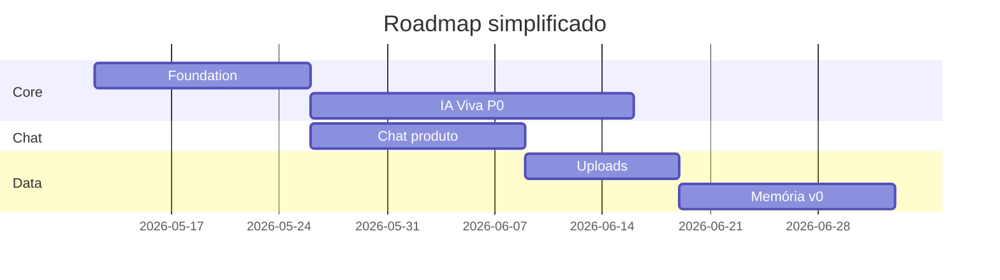

# Roadmap — The Solo Founder

**Objetivo:** traduzir a PRD em **ondas entregáveis** com critérios de aceite macro e dependências.  
**Relaciona com:** [`/docs/prd/PRD-The-Solo-Founder.md`](/docs/prd/PRD-The-Solo-Founder.md).

---

## Visão geral por onda

| Onda | Nome | Duração indicativa | Outcome |
|------|------|--------------------|---------|
| W0 | Foundation | 2–3 semanas | auth, shell, tema, WS básico, **Mente do Founder (MVP)** + gate ao workspace |
| W1 | IA Viva P0 | 3–4 semanas | núcleo + idle/listening/thinking/generating |
| W2 | Chat produto | 2–3 semanas | markdown, código, streaming estável |
| W3 | Uploads | 2 semanas | pipeline + estado Reading |
| W4 | Modos | 1–2 semanas | Personal/Business + copy + motion split |
| W5 | Memória v0 | 2–3 semanas | opt-in, painel, políticas |
| W6 | Beta hardening | 2+ semanas | performance, a11y, segurança |

> Durações assumem time pequeno full-stack; ajustar por realidade.

---

## W1 — Critérios de aceite (exemplos)

- [ ] Núcleo renderiza 60fps em máquina referência com tier A.  
- [ ] Estados respondem a eventos sintéticos em < 100ms após recepção WS.  
- [ ] `prefers-reduced-motion` remove partículas.

---

## W6 — Beta hardening

- Teste de carga leve em WS (N conexões simultâneas).  
- Revisão de copy de erro e estados de reconexão.  
- Checklist legal mínimo (privacidade, termos).

---

## Dependências críticas

*(Diagrama ilustrativo — datas placeholder.)*

---

## Fora do roadmap MVP

Multiagentes, marketplace, automações complexas, voice realtime avançado — ver [`/docs/future-visions/vision-beyond-mvp.md`](/docs/future-visions/vision-beyond-mvp.md).

---

## Related (Obsidian)

- [[../prd/PRD-The-Solo-Founder|PRD]]
- [[../future-visions/vision-beyond-mvp|Future Visions]]
- [[../motion/motion-system|Motion System]]
- [[../README|Docs Hub]]

---

*Revisão quinzenal de roadmap com métricas da Seção 15 da PRD.*
